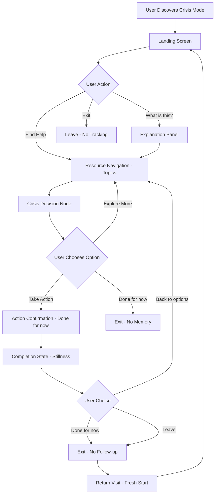
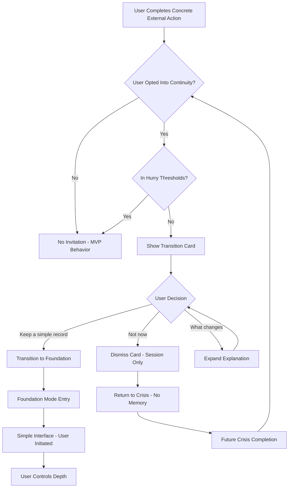
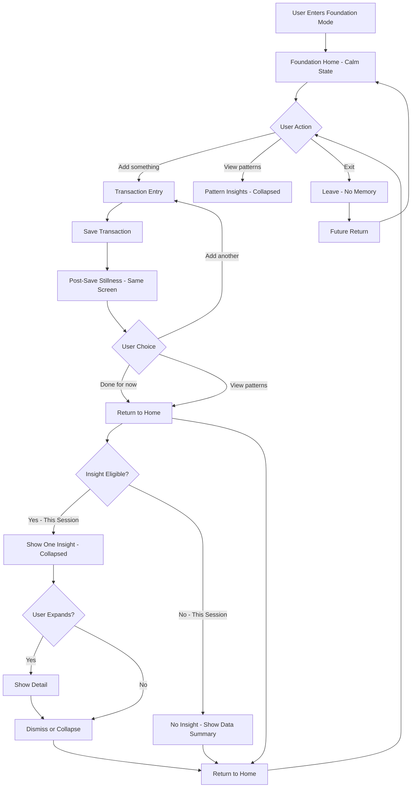
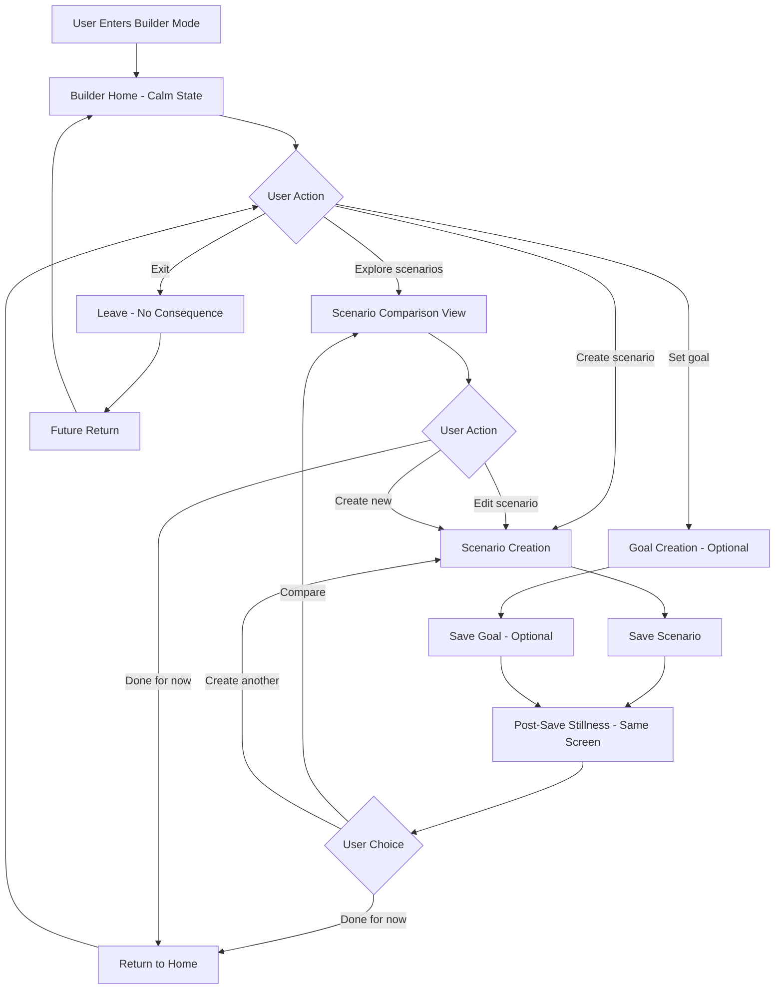
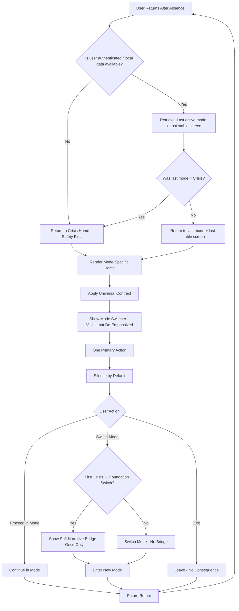

# UX Design Specification moneyshyft

**Author:** Jeremiah
**Date:** 2026-01-10

---

## Executive Summary

### Project Vision

MoneyShyft is a trauma-informed financial wellness platform that serves vulnerable populations through progressive disclosure across three modes: Crisis, Foundation, and Builder. The core problem users are solving is not "budgeting"—it's reducing anxiety, regaining control, and avoiding catastrophic outcomes. Budgeting is a means, not the goal.

**Key Vision Principles:**
- **Crisis-first approach:** Crisis Mode is a standalone intervention that may lead to a relationship, not a conversion funnel
- **Trust as foundation:** The primary success metric in early stages is "I don't feel judged or trapped here"
- **Progressive capability:** Users grow with the product as they build readiness, not forced progression or feature gating
- **Agency over accuracy:** Early stages prioritize understanding and control over precision. Being directionally right is more valuable than being numerically perfect
- **Dignity-preserving:** Every interaction must preserve user agency and avoid retraumatization

### Target Users

**Primary Users:** Unbanked and underbanked households (5.9M+ in U.S.), disproportionately low-income, minority, immigrant, and rural populations experiencing financial trauma and distrust of traditional banking systems.

**User Characteristics:**
- **Tech-savvy level:** Competent but exhausted; familiar with common mobile patterns but low tolerance for novelty under stress
- **Devices:** Mobile-first (non-negotiable), Android overrepresented, desktop usage increases in Builder Mode but cannot be assumed
- **Usage patterns:**
  - **Crisis Mode:
- Crisis Mode return states must remain generic and non-personalized unless the user explicitly opts into continuity.** Emotionally charged moments, often on poor connections, immediate need for actionable help
  - **Foundation Mode:** Short, frequent check-ins for awareness building
  - **Builder Mode:** Longer, intentional planning sessions, often with another person present (household collaboration)
- **Core needs:** Reducing cognitive overload under stress, externalizing financial cognition, making plans that survive real life

**What Users Are NOT Trying to Do:**
- Optimize spending (too early)
- Achieve precision without agency
- Be judged for inconsistency
- Be trapped in a system
- Solve everything at once

### Key Design Challenges

1. **Progressive Disclosure Without Overwhelm**
   - Clear mode boundaries that feel natural, not mechanical
   - Three distinct modes (Crisis/Foundation/Builder) that feel coherent yet appropriately different

2. **Trauma-Informed Design Implementation**
   - Language, error messages, and interactions that never retraumatize
   - Exit paths as visible and important as entry paths
   - Optionality as safety mechanism, not just a feature
   - "You can stop anytime" must be visible, not implied

3. **Mode Transitions Must Be Narrative, Not Mechanical**
   - Transitions should answer "Why now?", "What changes?", "What stays the same?"
   - Foundation Mode invitation must feel like support, not extraction
   - No nudging toward signup or conversion in Crisis Mode
   - Transitions should feel like natural progression, not bait-and-switch

4. **Agency Over Accuracy**
   - Early stages prioritize understanding and control over precision
   - Being directionally right is more valuable than being numerically perfect
   - Protects Foundation Mode from becoming a "tracking app"
   - Protects Builder Mode from over-modeling
   - Aligns with trauma-informed practice and real-world instability

5. **Accessibility and Device Constraints**
   - WCAG 2.1 Level AA compliance from day one
   - Works on older devices (Android 8+, iOS 14+)
   - Crisis Mode must function without JavaScript
   - One-handed mobile use as primary interaction pattern

6. **Complexity Without Overwhelm**
   - Builder Mode has powerful features but must not intimidate
   - Balance capability with simplicity
   - Visuals > numbers, comparisons > absolutes, "What happens if..." beats "You should..."

7. **Silence Is a Feature**
   - Sometimes the best UX is not asking another question, not showing another chart
   - Letting users sit with information without over-helping
   - Avoiding the fintech pattern of constant intervention

### Design Opportunities

1. **First-Mover in Trauma-Informed Fintech UX**
   - Set design patterns that others will follow
   - Build trust through design, not just features
   - Establish thought leadership in trauma-informed financial technology

2. **Progressive Disclosure as Competitive Advantage**
   - Users grow with the product naturally
   - Reduces abandonment from complexity overwhelm
   - Creates emotional safety that traditional fintech lacks

3. **Crisis Mode as Trust-Building Entry Point**
   - Help first, relationship later
   - Build trust through immediate value without extraction
   - Standalone intervention that may lead to deeper engagement

4. **Builder Mode as Shared Cognitive Space**
   - Externalize cognition—plans, tradeoffs, and constraints live outside users' heads
   - Household collaboration creates accountability without judgment
   - Visual planning tools that make abstract financial concepts tangible

5. **Moments of "This Is Exactly What I Needed"**
   - Not feature-based, but emotional moments:
     - Crisis Mode: "Someone finally explained this without making me feel stupid"
     - Foundation: "I didn't realize this pattern, but now it makes sense"
     - Builder: "I can see a path that doesn't require perfection"
   - These moments are the true success metrics, not feature adoption

---

## Silence as a Feature

**Definition:** Silence is a deliberate absence of pressure that preserves agency, reduces cognitive load, and signals trust. That's not passive UX. It's a constraint.

### Implementation Patterns by Mode

#### Crisis Mode Screens

**Goal:** Reduce panic, avoid cognitive overload.

**Implementation patterns:**
- **Primary content is informational, not actionable**
  - Headline: what's happening / what this means
  - Body: plain-language explanation
  - Actions are secondary, visually de-emphasized
- **No auto-advance**
  - User explicitly chooses next node
  - Single next step max
  - If multiple actions exist, show them as alternatives, not a checklist
- **Exit is always visible**
  - "I'll come back later"
  - "I'm done for now"
- **No timers, no progress bars**
  - Time pressure increases stress

**What not to do:**
- No "Next" button without context
- No "recommended" badges
- No "most people do X"

#### Foundation Mode: Transaction Logging

**Goal:** Awareness, not correction.

**Implementation patterns:**
- **Logging screen ends in stillness**
  - After save → confirmation + stop
  - No "Now do this" prompt
- **Pattern insights appear after logging, not during**
  - "Here's something we noticed" shown on return, not immediately
  - One insight at a time
  - Literally cap at one surfaced insight per session.

**Session Definition:** A session is a continuous foreground interaction period, ending after 30 minutes of inactivity or app backgrounding.
- **Expandable detail**
  - Summary first, details on tap
- **No streak pressure**
  - Neutral language: "You logged 3 times this week" (not "Great job!")

**UI cue:**
- Use visual whitespace after completion—don't immediately fill the screen with content.

#### Foundation Mode: Insights / Reality Mirror

**Goal:** Recognition without judgment.

**Implementation patterns:**
- **Insight → pause**
  - Insight card with no CTA attached
  - User must scroll or tap to continue
- **Language hedging**
  - "It looks like…"
  - "You might notice…"
  - No corrective suggestions by default
  - Suggestions behind an explicit "Explore options" affordance
- **Dismissible insights**
  - "Hide this for now" is always allowed

**Anti-pattern:**
- Insight immediately followed by "Fix it" button

#### Builder Mode: Goals & Scenarios

**Goal:** Shared cognition, not optimization pressure.

**Implementation patterns:**
- **Scenario comparison is read-only first**
  - No forced choice
  - No "best option" labeling
- **Explicit stopping points**
  - "You've seen the comparison. You don't have to decide now."
- **Adjustments are user-initiated**
  - Sliders and inputs are dormant until touched
- **One active goal**
  - Silence is protected structurally by limiting scope

**Household-specific:**
- No "nudge" when another household member views
- Viewing ≠ decision-making

#### Settings / Account / Admin-Adjacent Screens

**Goal:** Avoid accidental pressure.

**Implementation patterns:**
- **No warnings unless necessary**
- **Neutral confirmations**
  - "Saved" > "Success!"
- **Plain exits**
  - "Leave settings" not "Cancel changes"

### Measuring Silence

**You do not measure silence by engagement volume. You measure it by absence of distress signals.**

#### Quantitative Signals (What to Track)

**Positive indicators:**
- **Completion without escalation**
  - Crisis Mode completion without bounce + without account creation
- **Return without prompting**
  - Users come back later without reminders
- **Low rapid-fire action chaining**
  - Few back-to-back clicks in short time windows
- **Longer dwell time without interaction**
  - Reading, not clicking

**Negative indicators (silence failing):**
- Rage-clicking
- Immediate backtracking
- Rapid exits immediately after insight surfaces
- Excessive help panel opening right after content loads

#### Qualitative Signals (More Important)

**User language in feedback:**
- "I felt like I could breathe"
- "It didn't rush me"
- "I didn't feel dumb"

**Support tickets:**
- Fewer "What should I do?" messages
- More "Can I do X?" messages (agency)

#### A Simple Internal Heuristic

If a user completes a meaningful step and does nothing for 5–10 seconds, silence is probably working.

**Don't "fix" that.**

### When Silence Should Be Broken

Silence is not the same as abandonment. You break silence only under specific conditions.

#### Break Silence When Safety Is at Risk

- Crisis escalation indicators
- Hard deadlines (eviction date within X days)
- Explicit user confusion ("I don't understand")

**How:**
- Direct, concrete guidance
- No optional framing
- Still non-judgmental

#### Break Silence When the User Explicitly Asks

- Taps "What can I do?"
- Expands "Show options"
- Requests help or explanation

**Rule:** User action authorizes interruption.

#### Break Silence When the System Would Otherwise Feel Broken

- Empty states with no context
- Dead ends
- Errors that block progress

**Even then:**
- Explain once
- Offer one path forward
- Allow exit

#### Do NOT Break Silence To:

- Increase engagement
- Encourage signup
- Improve "activation"
- Push best practices
- Enforce consistency

**Those are product goals, not user needs.**

---

## Trust as a Success Metric

**Definition:** Trust is a user's willingness to return, act voluntarily, and share private information without coercion.

**Core Principle:** Trust is inferred, not declared. You should never ask "Do you trust us?" Trust is measured through behavior under low pressure.

### System Implementation: Trust Tracking

#### Instrumentation Model (What to Track)

Think in three layers: events, sessions, and longitudinal states.

**1. Event-Level Signals (Low-Level)**

Log these quietly, without surfacing them to the user:

- **Action origin**
  - `user_initiated = true | false`
  - Example: user opens "Explore options" vs. system auto-suggest
- **Exit context**
  - Explicit exit button vs. browser close vs. back navigation
- **Interaction cadence**
  - Time between actions
  - Number of actions per minute
- **Help invocation**
  - User-initiated help vs. system-displayed help

**Important:** Do not log content of what they type for trust measurement—only metadata.

**2. Session-Level Signals (Interpretation Layer)**

Derived metrics per session:

- **Completion without escalation**
  - Finished flow without:
    - creating an account
    - triggering help
    - bouncing mid-flow
- **Silence tolerance**
  - Time spent idle after meaningful content is shown
- **Voluntary continuation**
  - Did the user take a next step without being prompted?

This is where "silence working" becomes measurable.

**3. Longitudinal Trust Indicators (Stateful)**

These should live in a TrustSignals table or materialized view, not mixed with engagement metrics:

- **Return after absence**
  - 14, 30, 60-day return windows
- **Private content creation**
  - Goals, notes, scenarios, households
- **Persistence through non-perfect behavior**
  - Gaps in usage followed by return
- **Mode transitions**
  - Crisis → Foundation without coercion
  - Foundation → Builder without discount pressure

#### Explicit Non-Metrics (Important)

To protect trust, you should refuse to treat these as success metrics:

- Daily active users (DAU) as a primary KPI
- Session length as a goal
- Number of nudges accepted
- Conversion rate from Crisis Mode

These can be observed, but never optimized.

### Metric Balancing: Trust vs. Business Metrics

**The Tension:** Trust is a lagging indicator that often looks like "less activity" in the short term. That means you have to design both the instrumentation and the decision rules so trust doesn't get accidentally optimized away.

#### Separate Scorecards

Create two dashboards that are intentionally not merged:

**Trust Scorecard:**
- Return after absence
- User-initiated actions %
- Private artifact creation
- Low-distress sessions
- Qualitative trust language frequency

**Business Scorecard:**
- Active households
- Sponsored licenses in use
- Builder Mode adoption (not speed)
- Retention at 90+ days
- Cost per supported household

**Rule:** No single decision can be justified by only one dashboard.

#### Decision Arbitration Rule (Very Important)

In cases of conflict, trust metrics override engagement metrics by default unless an explicit exception is approved by Product Lead.

Exceptions must be documented with:
- The specific engagement metric being optimized
- The expected trust impact and how it will be monitored
- A rollback plan if trust signals degrade

#### Time-Horizon Alignment

- **Trust metrics:** evaluated at 30–90 days
- **Business metrics:** evaluated at 90–180 days

If you evaluate both weekly, trust will always lose.

#### Guardrails Against "Growth Hacks"

Introduce negative metrics that trigger review:

- Increase in rage-clicking
- Increase in "What should I do?" tickets
- Drop in silent dwell time
- Spike in immediate post-insight exits

If these rise, growth experiments pause automatically.

### Trust-Building Moments

Trust isn't built continuously. It's built at specific moments of vulnerability.

#### High-Leverage Trust Moments (By Mode)

**Crisis Mode:**
- Explaining something without pushing action
- Offering help without asking for identity
- Allowing completion without follow-up

**Trust moment:** "I got what I needed and you didn't ask for anything."

**Foundation Mode:**
- First surfaced pattern
- First missed day (non-use)
- First return after absence

**Trust moment:** "You didn't punish me for being inconsistent."

**Implementation:**
- No warnings
- No reset
- No guilt language

**Builder Mode:**
- Scenario comparison with no "best" label
- Ownership transfer or household invite
- License/sponsorship transitions

**Trust moment:** "You're not trying to trap me or upsell me."

#### Language as a Trust Mechanism

Adopt probabilistic, non-authoritative language at trust moments:

- "It looks like…"
- "You might notice…"
- "Some people choose to…"
- "You don't have to decide now"

**Avoid:**
- "Recommended"
- "Best option"
- "You should"

#### Trust-Preserving Failure Handling

Errors are trust tests.

**Rules:**
- Explain what happened
- Explain what did not happen ("Your data is safe")
- Offer one next step
- Always offer exit

No retry loops. No panic tone.

### Synthesis

**Trust is operationally defined as:**

A user's willingness to return, act voluntarily, and share private information without coercion.

**That means:**
- Trust tracking lives in behavioral metadata
- Trust metrics are protected from growth pressure
- Trust-building moments are designed, not hoped for
- Silence, exits, and non-action are valid outcomes

---

## Narrative Mode Transitions

**Core Principle:** Mode transitions must be narrative, not mechanical. They should answer "Why now?", "What changes?", and "What stays the same?" and feel like invitations, not gates.

**Design Philosophy:** Transitions are narrative beats, not funnels. They treat readiness as situational, not behavioral compliance. They use language as a safety mechanism and avoid dark patterns common in fintech.

### Transition Copy Examples

Each example explicitly answers Why now? / What changes? / What stays the same? and is written as an invitation, not a gate.

#### Crisis → Foundation

**Context trigger:** User completes a Crisis node or reaches a natural "what happens next" pause.

**Primary card copy:**
> You took action today.
> 
> If you want, you can keep a simple record of what's coming in and going out—just to make things feel less foggy.
> 
> This isn't about fixing everything. It's just about seeing patterns when you're ready.

**Secondary text (collapsed by default):**
- What changes: You can jot things down over time.
- What stays the same: No pressure, no judgment, no bank connections.

**Actions:**
- Primary: "Try this when you're ready"
- Secondary: "Not now"
- Tertiary (quiet): "What is this?" (expands explanation)

**Dismiss behavior:**
- Dismiss permanently for this session
- Reappears only after a new Crisis completion

#### Foundation → Builder

**Context trigger:** User has logged data long enough for a meaningful pattern or has returned after a gap.

**Primary card copy:**
> You're starting to see how things really work.
> 
> Some people find it helpful to explore "what if" plans—without committing to anything yet.
> 
> You can keep doing exactly what you're doing, or you can explore options.

**Secondary text:**
- What changes: You can try scenarios and set goals.
- What stays the same: Nothing auto-changes. No decisions are locked in.

**Actions:**
- Primary: "Explore scenarios"
- Secondary: "Stay where I am"
- Tertiary: "What does planning look like?"

#### Builder → Household Collaboration (Optional)

**Context trigger:** User creates a goal or scenario that affects shared finances.

**Primary copy:**
> Some people do this together.
> 
> If sharing decisions would help, you can invite someone. If not, everything still works solo.

**What changes / stays:**
- What changes: You can plan together.
- What stays the same: You stay in control.

**Actions:**
- "Invite someone"
- "Keep this just mine"

#### Mode Downgrade / Pause (Any Direction)

**Context trigger:** User manually steps back or disengages.

**Copy:**
> You don't lose progress by stepping back.
> 
> Everything you've done stays here. You can come back anytime.

**Actions:**
- "Pause for now"
- "Switch modes"

**This copy is critical for preserving trust after disengagement.**

### Visual Design Patterns for Transition Cards

Transition cards should look informational, not promotional.

#### Card Anatomy (Recommended)

- No bright accent colors
- Neutral background (off-white / light gray)
- Soft border or divider—not elevation
- Icon only if it's informational (e.g., compass, notebook—not arrows or locks)

**Structure:**
```
[ small contextual label ]
[ short validating headline ]
[ 2–3 sentence explanation ]
[ optional "What changes / What stays" disclosure ]
[ actions (primary + secondary + quiet exit) ]
```

#### Placement Rules

- Never full-screen
- Inline with content, near natural pause points
- Never interrupt task completion
- One transition card max per screen

#### Interaction Rules

- No auto-focus
- No auto-open modals
- No repeated re-showing within same session
- Dismiss state respected across sessions

#### Anti-Patterns to Explicitly Avoid

- Progress bars between modes
- Locked states ("Upgrade to continue")
- "Recommended for you"
- Badges like "Next step"
- Countdown language or urgency cues

### Readiness Signal Detection

Readiness should be inferred quietly, never announced.

#### Crisis → Foundation Readiness

**Signals:**
- Completion of a Crisis flow
- Viewing "next steps" or explanations
- Spending time reading without bouncing

**Non-signals:**
- Clicking fast
- Rage clicking
- Returning repeatedly to same crisis node

**Rule:** Offer once per meaningful completion, then go silent.

#### Foundation → Builder Readiness

**Strong signals:**
- Pattern acknowledgment (user views aggregates)
- Return after a gap
- Manual edits to past entries
- Creation of notes or categories

**Weak signals (do not trigger):**
- Raw volume of transactions
- Daily usage streaks
- Speed of data entry

#### Household Readiness

**Signals:**
- Goals affecting shared expenses
- Mentions of "we" in notes (optional NLP post-MVP)
- Repeated scenario edits involving fixed/shared costs

**Rule:** Household is an option, never a requirement.

#### Cooldown & Silence Logic

Once a transition is dismissed:
- Silence for a defined period (e.g., 30 days or new signal)
- No escalating prompts
- No rephrased nudges

**Silence is not failure—it's respect.**

### What Makes This "Best Practice"

This approach works because it:
- Treats readiness as situational, not behavioral compliance
- Uses language as a safety mechanism
- Avoids dark patterns common in fintech
- Aligns business growth with earned trust
- Allows disengagement without penalty

**You're designing transitions as narrative beats, not funnels.**

---

## Core User Experience

### Defining Experience

**The Core Experience (Canonical):**

The core experience is not mode-specific. It is cross-mode and expresses itself differently in each mode.

**Core Experience Statement:**

> "I can put something true outside my head, look at it safely, and nothing bad happens."

That's the thing users will describe to others. Everything else (budgeting, scenarios, goals, resources) is implementation detail.

**If you get one thing right, it is this:**

**Externalization without consequence.**

**What Users Will Describe to Friends (Plain Language):**

Not features. Not modes. This:
- "It lets you look at your money without getting yelled at."
- "You can explore stuff and it doesn't push you."
- "You can stop halfway and nothing breaks."
- "It doesn't freak out if you're inconsistent."

If a user can truthfully say any one of those, the core experience is working.

**Mode-Local Core Actions (Must Be Excellent):**

- **Crisis Mode:** Taking a concrete, real-world action (call, apply, decide, show up)
- **Foundation Mode:** Recording reality as it is (logging without judgment)
- **Builder Mode:** Exploring "what if" safely (scenario comparison without commitment)

If any of these are bad, that mode fails.

**The Cross-Mode Core Action (The Real Keystone):**

**Choosing to continue.**

Not "engagement." Not "conversion." The user action you must get right is:

**"I'm willing to stay with this a little longer."**

That shows up differently in each mode:
- **Crisis:** "I trust this enough to finish this step."
- **Foundation:** "I'll come back later."
- **Builder:** "I'll try a plan instead of avoiding it."

**Critical Distinction:** If you optimize for progression itself, you risk recreating a funnel. Progression must be possible, not promoted.

**Conclusion:** The most critical thing is not any single action—it's making continuation feel safe and optional. If you nail that, the mode-specific actions follow.

**Core Experience Principle (Final):**

MoneyShyft succeeds when users feel safer after interacting with reality—without being evaluated, rushed, or corrected.

Everything else is secondary.

### User Mental Model

**What They're Replacing:**

**How they solve this today:**
- Mental tracking (fragile, anxiety-inducing)
- Paper notes (safe but disconnected)
- Spreadsheets (powerful but punishing)
- Avoidance (most common)

**Why existing tools feel terrible:**
- They evaluate before they understand
- They punish interruption
- They confuse accuracy with morality
- They treat inconsistency as failure

**What feels "magical" when it works:**
- Seeing reality without consequences
- Being allowed to be unfinished
- Discovering patterns without being told what to do

**MoneyShyft's Job:**

MoneyShyft's job is not to be smarter than the user.

**It's to be safer than their head.**

### Success Criteria

**Users say "this just works" when:**
- They can stop mid-action and return later
- They're not corrected immediately
- The system reflects, not reacts

**They feel smart when:**
- The app mirrors something they already sensed
- The insight feels obvious in hindsight
- No badge, confetti, or praise is required

**Feedback that tells them they're "doing it right":**

**Best practice: neutral confirmation, not encouragement.**

**Examples:**
- "Saved."
- "Added."
- "Here's what that looks like."

**No:**
- "Great job!"
- "Keep going!"
- "You're on track!"

**Speed:**
- Interaction latency must be sub-second
- Cognitive latency must be immediate
- Emotional latency must be calming, not energizing

### Experience Mechanics

**This is the spine of the core experience.**

#### Initiation (How It Starts)

**Best practice:**
- User-initiated only
- No nags, no countdowns, no "start here"

**Examples:**
- "Add something"
- "Look at options"
- "What's happening right now?"

#### Interaction (What They Do)

**Best practice:**
- One small, obvious action
- No branching decisions mid-action
- No forced categorization up front

**Examples:**
- Enter a transaction
- View a scenario
- Read a resource step

#### Feedback (How the System Responds)

**Best practice:**
- Reflect reality
- Do not interpret immediately
- Do not prescribe

**Pattern:**

**Input → mirror → pause**

**Not:**

**Input → judgment → next step**

#### Completion (How They Know They're Done)

**Best practice:**
- Stillness
- No auto-advance
- No CTA escalation

**Completion is signaled by:**
- The interface becoming quiet
- The next step being optional, not prominent

### Which Mode to Focus On First?

**Foundation Mode defines the core experience.**

- Crisis Mode earns trust.
- Builder Mode uses trust.
- Foundation Mode teaches the system how to behave.

**If Foundation Mode fails, Builder Mode becomes coercive.**
**If Foundation Mode works, Builder Mode feels empowering.**

**So:**
- Design the core interaction in Foundation Mode
- Then adapt it:
  - Crisis = externalize urgency safely
  - Builder = externalize decisions safely

### Platform Strategy

**Platform Requirements (Locked):**

- **Mobile-first:** Non-negotiable
- **Touch-first:** Primary interaction pattern
- **Crisis Mode without JavaScript:** Core functionality must work without JS
- **Offline Foundation logging:** IndexedDB support for transaction logging
- **Older devices:** Android 8+, iOS 14+ support
- **One-handed use:** Primary interaction pattern

**The Missing Implication: Interruption Tolerance**

Interruption tolerance is a platform requirement. This isn't just offline support. It means:

- Mid-action abandonment must be safe
- Partial completion must not feel like failure
- Returning after days or weeks must feel normal

**Design Implications:**
- No fragile multi-step flows
- No "you were in the middle of…" guilt
- Every screen must tolerate being the last screen a user sees

This matters more than desktop vs mobile.

### Effortless Interactions

**Must Be Effortless:**

1. **Stopping**
   - Leaving a screen
   - Closing the app
   - Ignoring a suggestion
   - If stopping feels heavy, trust collapses.

2. **Resuming**
   - No re-onboarding
   - No "catch-up" language
   - No backlog anxiety

3. **Partial Truth**
   - Logging "about $200"
   - "Not sure" as a valid input
   - Skipping categories entirely

4. **Correction**
   - Editing past entries without penalty
   - Changing goals without "reset" framing

5. **Understanding Without Acting**
   - Seeing a pattern without being asked to respond
   - Viewing a scenario without saving it

**Where Competitors Fail (And You Should Win):**

- They treat inaction as a problem
- They treat inaccuracy as error
- They treat silence as churn

You are doing the opposite.

### Critical Success Moments

**The "Worth It" Moments (Primary):**

- **Crisis Mode:** "I didn't get evicted / my power didn't get shut off / I fed my kids tonight"
- **Foundation Mode:** "I understand my money now / I know where it goes / I'm not as anxious"
- **Builder Mode:** "I made a plan and I'm sticking to it / I'm hitting my goals / I feel in control"

**Additional Critical Micro-Success Moments:**

**Crisis Mode:**
- "I know what to do next." (Even if they don't do it yet.)

**Foundation Mode:**
- "I didn't log perfectly, and nothing bad happened."
- "I skipped a week and wasn't punished."

**Builder Mode:**
- "I tried a plan and changed my mind."
- "This plan accounts for my messiness."

**Cross-Cutting:**
- "I can leave and come back."
- "This didn't ask me to be someone else."

**Make-or-Break Failures:**

Any moment where the system implies:
- Urgency
- Moral failure
- Optimization as virtue
- Permanence too early

One bad moment here undoes ten good ones.

### Experience Principles

**Refined Core Experience Principles:**

1. **Trust Before Utility**
   - If an interaction increases output but reduces trust, it is a failure.

2. **Continuation Over Completion**
   - The goal is not finishing tasks—it's willingness to return.

3. **Silence Is an Interface State**
   - Stillness, pause, and absence of instruction are deliberate design choices.

4. **Agency Over Accuracy**
   - Directional understanding beats numerical precision, especially under instability.

5. **Narrative, Not Funnel**
   - Mode transitions explain context; they never imply obligation.

6. **Interruption-Safe by Default**
   - Every flow must tolerate abandonment without consequence.

7. **Reality-First Design**
   - The system adapts to chaotic lives; users are never asked to adapt to the system.

### Critical Anti-Pattern: Premature Optimization Framed as Help

**The Root Pattern:**

Premature moralization through "helpful" optimization. This is the single most dangerous UX pattern to guard against.

**What This Pattern Looks Like:**

It shows up when the system subtly shifts from witnessing reality to evaluating behavior before the user is ready.

**Common Disguises:**
- "Insights" that imply judgment ("You spent more on X than usual" without context or permission)
- Action prompts immediately after disclosure ("Now set a goal," "You should consider…," "Next step:")
- Optimization framed as care ("We can help you save more if you just…")
- Precision pressure ("This doesn't add up," "Please fix," "Missing data")
- Silent defaults that encode values (categories, colors, warnings that imply good/bad behavior)

None of these are malicious. All of them are catastrophic for trust in trauma-affected users.

**Why This Is the Most Dangerous Pattern:**

Because it breaks all five of your core principles at once:
- Violates trust: The system stops being neutral.
- Destroys silence: It replaces pause with demand.
- Removes agency: It answers questions the user didn't ask.
- Reintroduces shame: Even gently, even accidentally.
- Collapses progression: Users don't leave loudly—they disappear.

This is the pattern that makes people say: "I thought this was different." And then never return.

**The Critical Insight:**

Optimization is not neutral. In financial tools, optimization is moralized by default, especially for low-income users.

The moment the system implies:
- there is a "better" way right now, or
- the user's current behavior is suboptimal before they asked, or
- improvement is expected as a response to honesty,

you've recreated the exact power dynamic they're fleeing.

**The Guardrail (Non-Negotiable):**

The system may not initiate judgment, urgency, or optimization. It may only respond when the user explicitly asks.

**Operationally:**
- No system-initiated "next steps" after logging
- No insights that imply action without consent
- No defaults that encode virtue or failure
- No escalation in tone based solely on data patterns
- No assumption that awareness must lead to change

Awareness can exist on its own. That is radical—and necessary.

**A Simple Test to Catch This Pattern:**

For any screen, prompt, or message, ask:

**"If a user does nothing after seeing this, do they still feel okay?"**

If the answer is anything other than yes, the pattern is unsafe.

**Naming It Matters:**

This anti-pattern is canonized as: **Premature Optimization Framed as Help**

So future designers, engineers, and AI agents know:
- this isn't a preference
- it's a line you do not cross

---

## Desired Emotional Response

### Primary Emotional Goals

**Primary Emotional Goals (In Order):**

1. **Safety**
   - "Nothing bad will happen to me here."
   - This is foundational and non-negotiable. Without it, all other emotions fail.

2. **Agency**
   - "I am choosing what happens next."
   - This differentiates MoneyShyft from coercive fintech and case-management tools.

3. **Relief**
   - "I can breathe."
   - Relief is the immediate payoff that keeps users from abandoning after first use.

4. **Legibility**
   - "I understand what's happening."
   - Not mastery—legibility. The world makes sense enough to act.

**Clarification:**
- Trust is not an emotion users feel directly; it is an outcome of repeated safety + agency experiences.
- Treat trust as an emergent property, not a screen-level goal.

### Emotional Journey Mapping

**Crisis Mode:**
- **Emotional Arc:** Calm → Clarity → Relief
- **Add: Containment**
  - Users should feel the situation is bounded, not spiraling.
  - "This problem has edges."
- **Failure mode to avoid:** Panic escalation through too many options or urgency cues.

**Foundation Mode:**
- **Emotional Arc:** Curiosity → Awareness → Understanding
- **Add: Neutrality**
  - Users should feel observed, not evaluated.
  - Data exists without commentary.
- **Failure mode to avoid:** Self-judgment triggered by premature interpretation.

**Builder Mode:**
- **Emotional Arc:** Confidence → Exploration → Accomplishment
- **Add: Reversibility**
  - "I can change my mind."
  - This is essential for trauma-exposed users.
- **Failure mode to avoid:** Feeling locked into a "correct" plan.

**Cross-Mode Return Emotion:**
- On re-entry (after days or weeks away), users should feel:
  - Welcome without obligation
  - "I wasn't punished for leaving."
- This is critical and often missed.

### Micro-Emotions

**Critical Micro-Emotions (Prioritized):**

1. **Safety > Anxiety**
2. **Agency > Pressure**
3. **Understanding > Confusion**
4. **Relief > Shame**
5. **Belonging (optional, later) > Isolation**

**Notes:**
- Excitement is not a goal. Excitement under stress often reads as manipulation.
- Delight is optional and late-stage. Satisfaction and steadiness matter more.

### Design Implications

**Emotion → UX Decision Mapping:**

**Safety:**
- No irreversible actions without confirmation
- No hidden consequences
- Language avoids moral framing ("good," "bad," "should")

**Agency:**
- Dismiss is always equal to proceed
- User chooses depth; system never escalates intent
- Defaults are neutral, not directional

**Relief:**
- End states are quiet
- No "next step" pressure
- Confirmation without instruction

**Understanding (Legibility):**
- Visual patterns before numbers
- Comparisons before totals
- Time-based views over categorical judgment

**Trust (Emergent):**
- Predictable behavior
- No surprise prompts
- No delayed punishment for past choices

### Emotional Design Principles

**Primary Emotional Outcome:**

"I don't feel judged or trapped here."

This is the correct north star.

**Secondary Emotional Outcomes:**
- Agency: "I'm deciding what happens."
- Relief: "I'm not being rushed or evaluated."
- Legibility: "This makes sense to me."
- Stability: "I can come back later without penalty."

**Emotions to Actively Avoid:**
- Shame
- Anxiety
- Overwhelm
- Trapped/obligated feeling
- Judgment
- Surveillance (being watched, scored, or monitored)

### Final Synthesis

**MoneyShyft should feel like:**

A calm, respectful surface where reality becomes visible without being weaponized.

**Not:**
- A coach
- A tracker
- A compliance tool
- A productivity system

This framing is operational, testable, and defensible.

---

## Emotional Goals: Implementation Guide

**Final Operational Rule:**

If a screen creates urgency, pressure, or obligation without user consent, it violates the emotional contract.

### Screen-Level Emotional Contract

Every screen must intentionally deliver one primary emotion and must not violate higher-order emotions.

**Screen Emotional Hierarchy (Enforcement Rule):**

Every screen must declare:
- Primary emotion it supports
- Emotions it must not violate

| Screen Type | Primary Emotion | Must Not Violate |
|------------|----------------|------------------|
| Crisis decision node | Safety | Agency |
| Crisis resource list | Legibility | Safety |
| Transaction entry | Agency | Safety |
| Pattern display | Legibility | Agency |
| Scenario comparison | Agency | Relief |
| Mode transition | Trust | Safety |

This prevents accidental emotional regressions.

### Implementing Emotional Goals in Screen Design

#### Safety in Screen Design

**Visual:**
- Neutral colors, no red/green judgment cues
- No countdowns, urgency badges, or alerts
- Stable layouts (no jumping elements)

**Content:**
- No irreversible language
- Avoid "success/failure"
- Use "here's what this means" instead of "you should"

**Interaction:**
- Every action has a visible escape
- Cancel and proceed are visually equal

**Example (Crisis Mode node):**
> "Here are your options. You don't need to decide everything right now."

#### Agency in Screen Design

**Rules:**
- System never auto-advances users
- Expansion is user-initiated
- No required fields unless functionally necessary

**Patterns:**
- "Show more" instead of default density
- Optional secondary actions
- Mode transitions are cards, not modals

**Example (Foundation Mode):**
- Transaction logged → quiet confirmation
- No "Next step" CTA
- No progress pressure

#### Relief in Screen Design

Relief comes from ending interactions well.

**Patterns:**
- End screens with stillness
- Confirmation without instruction
- Empty space after completion

**Example:**
> "Saved. You can come back whenever you want."

No follow-up prompt.

#### Legibility in Screen Design

**Rules:**
- One insight per screen
- Patterns before numbers
- Comparisons before totals

**Patterns:**
- Visual timelines
- Simple deltas ("more on weekends")
- "This vs that" layouts

**Anti-pattern:**
- Dashboards with multiple interpretations at once

### Measuring Emotional Outcomes (Without Surveys Everywhere)

You measure emotions by behavioral proxies, not self-report.

#### Safety Metrics

| Signal | Interpretation |
|--------|----------------|
| Low rage-clicking | User not panicking |
| Low backtracking | User not second-guessing |
| No sudden exits on sensitive screens | User feels safe continuing |

**Instrumentation:**
- Click velocity
- Back button frequency
- Rapid navigation loops

#### Agency Metrics

| Signal | Interpretation |
|--------|----------------|
| High dismissal rate of optional prompts | Users feel free to say no |
| User-initiated actions > system prompts | Agency preserved |
| No drop after "decline" | Declining isn't punished |

**Critical check:** If declining reduces future capability, you've broken agency.

#### Relief Metrics

| Signal | Interpretation |
|--------|----------------|
| Session ends after completion | User rests |
| No immediate follow-up action | Stillness working |
| Return later (not same session) | Relief > compulsion |

**Anti-metric:**
- Infinite engagement loops (bad for trust)

#### Legibility Metrics

| Signal | Interpretation |
|--------|----------------|
| Fewer edits after viewing insight | "I get it" moment |
| Scenario exploration without commit | Understanding without pressure |
| Re-viewing same insight later | Meaningful clarity |

#### Trust (Longitudinal)

Trust is slow. Measure over time:

| Signal | Why it matters |
|--------|----------------|
| Return after 14–30 days | System wasn't exhausting |
| Private content creation | User feels safe investing |
| No regression after absence | No punishment model |

### Designing for Cross-Mode Return Emotion

This is one of your strongest differentiators.

**Emotional Goal on Return:**

"I wasn't punished for leaving."

#### Rules for Return States

1. **No recap guilt**
   - ❌ "You haven't logged in 21 days"
   - ✅ "Welcome back"

2. **No catch-up pressure**
   - No "Here's what you missed"
   - No backlog tasks

3. **Resume from stability**
   - Last safe state, not last task
   - Neutral dashboard or overview

#### Return Screen Patterns

**Option 1: Quiet re-entry**
> "You're back. Here's where things were last time."

**Option 2: Choice-based re-entry**
- "Review"
- "Continue"
- "Do something else"

No default highlighted.

#### Mode-Specific Return Handling

**Crisis Mode:**
- No memory unless user asks
- No follow-ups

**Foundation Mode:**
- Show last known pattern, not missed logs
- Optional: "Add something new"

**Builder Mode:**
- Show plan snapshot
- Offer exploration, not enforcement

#### Measuring Cross-Mode Success

| Signal | Meaning |
|--------|---------|
| Return without friction | Trust preserved |
| No spike in exits on return | No shame |
| Users resume at own pace | Agency intact |

---

## Anti-Pattern Guardrail: Implementation Guide

**Global Rule (Binding):**

The system may not escalate intent. Only the user may escalate intent.

That means: no automatic movement from observation → recommendation → action without an explicit user signal.

### Screen-Level Implementation Patterns

#### Crisis Mode Screens

**Primary goal:** Enable action without evaluation.

**Allowed:**
- Clear information
- Direct actions (call, apply, download, save)
- Optional clarification links ("What this means")
- Exit at every step

**Disallowed:**
- Any account-related prompts
- Any "next steps" after action
- Any performance framing ("Most people also…")

**Implementation patterns:**
- **Action-first layouts:** One clear action per screen
- **No post-action follow-ups:** After clicking "Call," show silence or confirmation, not guidance
- **Explicit exit affordance:** "Done for now" always visible
- **No progress indicators:** Progress implies obligation

**Engineering guardrail:**
- Crisis routes cannot render components with:
  - CTAs that mutate user state
  - Auth prompts
  - Behavioral nudges

#### Foundation Mode Screens (Transaction Logging)

**Primary goal:** Externalize reality without pressure.

**Allowed:**
- Logging
- Passive summaries
- User-initiated views ("Show patterns")

**Disallowed:**
- "Now do this" flows
- Auto-surfaced insights tied to a single entry
- "Missing data" warnings unless user requests review

**Implementation patterns:**
- **End-in-stillness rule:** After a transaction save → show confirmation → stop.
- **Collapsed insights by default:** Patterns exist but are hidden behind intent ("View patterns").
- **No streaks, no scoring, no alerts.**

**Copy constraints:**
- Use descriptive language only ("This category appeared 4 times") not interpretive ("You're overspending").

**Engineering guardrail:**
- Insights pipeline requires:
  - Minimum data threshold
  - User opt-in per session
  - No insight generation on single events

#### Builder Mode Screens (Goals & Scenarios)

**Primary goal:** Support exploration, not correctness.

**Allowed:**
- Side-by-side scenarios
- Reversible changes
- "What if" framing

**Disallowed:**
- "Best option" labeling
- Default recommendations
- Locked paths or warnings framed as failure

**Implementation patterns:**
- **Neutral comparison layouts:** No highlighted "winner"
- **User-controlled depth:** Sliders and toggles expand, never auto-expand
- **Undo-first UX:** Undo always visible

**Engineering guardrail:**
- Scenario engine returns sets, not ranked results
- No scoring functions exposed to UI

### Measuring "Continuation Over Completion"

**Completion is a fintech metric. Continuation is a trust metric.**

**Replace completion metrics with continuation metrics:**

**Instead of:**
- % completing setup
- % finishing goals
- % converting modes

**Measure:**
- Return after silence
- Re-engagement without prompts
- Time-to-next-self-initiated action

#### Concrete Metrics to Implement

**A. Return After Quiet**
- User returns after ≥14 days with no system prompts
- Strong trust signal

**Implementation:**
- Track session starts where no notifications were sent in prior 14 days

**B. Self-Initiated Depth**
- % of sessions where user:
  - Opens insights
  - Runs scenarios
  - Creates goals
- without being prompted

**Implementation:**
- Tag actions as `user_initiated` vs `system_exposed`

**C. Abandonment Without Churn**
- User exits mid-flow and later returns
- Leaving ≠ failure

**Implementation:**
- Treat incomplete flows as neutral
- Success = later return, not completion

**D. Silence Acceptance Rate**
- After showing information, user takes no action and does not bounce permanently

**Implementation:**
- Track "view-only sessions" that still lead to future engagement

**Red Flag Metrics (Do Not Optimize For):**
- Time-on-task
- Steps completed per session
- Immediate conversions

These incentivize pressure.

### Designing for Interruption Tolerance

**Interruption tolerance is core to dignity.**

**Design Assumption (Non-Negotiable):**

Every session may be interrupted. Phones die. Kids cry. Anxiety spikes.

If interruption breaks the experience, trust collapses.

#### Screen-Level Patterns

**A. Safe Pause Everywhere**
- Every screen has a non-destructive exit:
  - "Done for now"
  - "Save and close"
  - No confirmation guilt ("Are you sure?")

**B. Stateless Progress**
- No flow requires memory of previous steps
- No "you left off here" framing that implies obligation

**Implementation:**
- Save state silently
- Resume optionally, not automatically

**C. Idempotent Actions**
- Repeating an action causes no harm
- Logging the same thing twice is allowed and fixable

**Implementation:**
- Soft deduplication
- Easy undo

**D. No Countdown Language**
- No time pressure
- No "finish setup" framing

#### Engineering Implications

All writes must be:
- Atomic
- Reversible
- No multi-step commits without checkpoints
- Autosave without UI acknowledgement

### Canonical Design Test (Use Everywhere)

Before shipping any screen, ask:

1. **Can the user leave right now without consequence?**
2. **If they do nothing, does the system stay neutral?**
3. **If they return later, is nothing lost and nothing assumed?**
4. **Did the system wait for permission before helping?**

If any answer is no, the guardrail is violated.

### Final Synthesis

**The anti-pattern you're guarding against isn't "bad UX."**

**It's recreating power asymmetry through helpfulness.**

Your architecture already supports the right posture. These patterns make it operationally enforceable.

---

## UX Pattern Analysis & Inspiration

### Inspiring Products Analysis

**WhatsApp / Facebook Messenger**

**Why it matters:**
- Used across income, language, and device constraints
- Trusted in high-stress, real-world coordination
- Zero learning curve under pressure

**What they do well:**
- Clear affordances (send, read, done)
- No pressure to respond immediately
- Conversations persist without penalty
- Silence is normal and respected

**Why users return:**
- Reliability
- Familiarity
- Low cognitive load

**MoneyShyft takeaway:**
- Persistence without obligation
- Clear "last known state"
- No punishment for absence

---

**Google Maps**

**Why it matters:**
- Used in stressful, real-time situations
- Handles ambiguity and change gracefully
- Gives options without judgment

**What it does well:**
- Shows options, not commands
- Re-routes quietly when reality changes
- Never says "you messed up"

**Why users trust it:**
- It adapts instead of blaming
- It explains why something changed
- It keeps users oriented

**MoneyShyft takeaway:**
- "Here's what changed" beats "you failed"
- Scenario comparison > single correct answer
- Plans must survive disruption

---

**Mint Mobile / Utility Portals (simple ones)**

**Why they matter:**
- Users already distrust them—and still use them
- Best ones minimize interaction and guilt

**What they do well (when done right):**
- Straightforward balances
- Simple status language
- No gamification

**Why users tolerate them:**
- Predictability
- No emotional manipulation

**MoneyShyft takeaway:**
- Neutral tone builds trust faster than cheerfulness
- Less branding noise = more credibility

---

**YouTube (passive mode)**

**Why it matters:**
- Safe consumption without commitment
- User controls pace entirely
- No obligation to act

**MoneyShyft takeaway:**
- Information without forced action
- Learn → pause → decide later

---

### Transferable UX Patterns

**Onboarding (or lack of it)**

**Best practice across these apps:**
- Minimal or skippable onboarding
- Learn by doing
- No "setup ceremony"

**Implication:**
- Crisis Mode: zero onboarding
- Foundation: implicit learning
- Builder: opt-in guidance only

---

**Navigation & Hierarchy**

**Patterns that work:**
- Bottom navigation with 3–5 items max
- Clear "home" or anchor state
- No deep nesting under stress

**Anti-pattern:**
- Hamburger menus hiding core actions

**MoneyShyft application:**
- Bottom nav: Now / Patterns / Plans
- Crisis Mode: linear, visible path
- Builder Mode: tabbed comparison views

---

**Information Presentation**

**Winning pattern:**
- Show state first, actions second
- Highlight change, not totals
- One insight per screen

**From Maps:**
- "Traffic is heavier than usual"
- Not "Your ETA increased by 14%"

---

**Error & Edge Case Handling**

**What good apps do:**
- Explain what happened
- Offer options
- Don't assign fault

**MoneyShyft rule:**
Errors should sound like weather, not judgment.

**The Weather Report Test:**
Read error messages aloud. If they sound like a weather report ("Traffic is heavier than usual"), they're safe. If they sound like evaluation ("You failed to complete"), they violate safety.

---

**Interaction Patterns**

**Transferable patterns:**
- User-initiated expansion only
- No auto-advance
- No forced confirmations unless destructive

---

**Visual Patterns**

**Transferable patterns:**
- Neutral palettes
- High legibility typography
- White space as safety

---

**State Persistence**

**Transferable patterns:**
- Always return users to a calm, stable view
- Never a "catch-up" screen
- Never a guilt summary

---

### Anti-Patterns to Avoid

**Gamification of hardship:**
- Streaks
- Badges
- "Consistency" rewards

**Moralized language:**
- "Healthy spending"
- "Bad habits"
- "Discipline"

**Conversion masquerading as help:**
- "Create an account to save your progress"
- "Upgrade to continue"

**False urgency:**
- Timers
- "Only X days left"
- Flashing alerts

**Over-celebration:**
- Confetti for basic survival actions
- Forced positivity

---

### Design Inspiration Strategy

**Adopt:**
- Google Maps' adaptability
- Messaging apps' tolerance for silence
- Utility apps' neutrality

**Adapt:**
- Scenario comparisons → financial planning
- Route alternatives → budget paths
- Status language → emotional safety

**Avoid:**
- Fintech dopamine loops
- "Behavior change" dark patterns
- Productivity guilt UX

---

### Connection to Trust Metrics

**Pattern-to-Metric Mapping:**

**WhatsApp's "silence is normal and respected"** → **Silence Acceptance Rate**
- Track "view-only sessions" that still lead to future engagement

**Google Maps' "adapts instead of blaming"** → **No Regression After Absence**
- Users return without punishment for leaving

**Utility portals' "neutral tone"** → **High Dismissal Rate of Optional Prompts**
- Users feel free to say no without consequence

**YouTube's "information without forced action"** → **Self-Initiated Depth**
- Users open insights, run scenarios, create goals without being prompted

---

### Final Synthesis

**North Star:**

MoneyShyft should feel less like a coach and more like a calm, competent guide who doesn't panic when reality changes.

**Operational Test:**

Every screen should pass: "If reality changes, does the system adapt without blame?"

This connects to our interruption tolerance design. Like Google Maps re-routing, MoneyShyft should handle financial reality changes gracefully.

---

## Design System Foundation

### Design System Choice

**Selected Stack: Radix Vue + Tailwind CSS + Custom Component Library**

**Core Components:**
1. **Tailwind CSS** (already decided in architecture)
2. **Radix Vue primitives** (Dialog, DropdownMenu, Popover, Tabs, Toast, Tooltip, etc.)
3. **Custom component layer** (`<MsButton>`, `<MsCard>`, `<MsField>`, `<MsNotice>`, etc.)
4. **Design tokens** enforced in Tailwind theme (colors, spacing, radii, shadows, fontSize, lineHeight)

**Optional Accelerators:**
- **Tailwind UI:** Use as inspiration for layouts and spacing patterns, but avoid importing large swaths of styled components early (it'll fight your emotional constraints)
- **Form library:** Either vee-validate + zod or "simple forms + zod" for MVP. Keep it boring.

### Rationale for Selection

**Why Radix Vue over Headless UI (Vue):**

Headless UI's Vue support exists, but Radix-style primitives are generally a better long-term bet for:
- **Accessibility primitives completeness** (menus, dialogs, popovers, roving tabindex patterns, etc.)
- **Predictable API surface** for building a consistent internal component library
- **Avoiding "template-y" default patterns** that sneak in visual/interaction assumptions

If your team is already fluent with Headless UI Vue and wants speed over purity, Headless UI is still acceptable. But if you're choosing "best practice" for a product where trust and a11y are binding, Radix Vue primitives + your own tokens is the cleaner architecture.

**Why Not PrimeVue/Quasar:**

- Too opinionated visually; you'll spend time undoing them
- Default styling conflicts with neutral palette goals
- Includes components we don't need
- Harder to achieve "calm, competent guide" aesthetic

**Why Not Pure Custom from Scratch:**

- Avoidable a11y risk without headless primitives
- Slower development without proven accessibility patterns
- Higher maintenance burden

### Implementation Approach

**Library Structure (Monorepo-Friendly):**

```
packages/ui/
  src/
    components/
      MsButton.vue
      MsCard.vue
      MsField.vue
      ...
    tokens/
      tailwind.preset.js (or .ts)
    a11y/
      focusRing.ts
      aria.ts
    copy/
      bannedPhrases.ts
  package.json
  tsconfig.json
```

Then the app imports only from `@moneyshyft/ui`.

**MVP Component Library Scope (10–15 Components):**

**Foundation Components (Must Exist First):**
1. `MsButton`
2. `MsLink`
3. `MsCard`
4. `MsText` (typography wrapper: headings/body/caption)
5. `MsField` (input + label + hint + error)
6. `MsTextarea`
7. `MsSelect`
8. `MsCheckbox`
9. `MsRadioGroup`
10. `MsDialog` (Radix primitive wrapped)
11. `MsSheet` (mobile bottom sheet; Radix Dialog variant)
12. `MsToast` (rare use, non-urgent tone)
13. `MsNotice` (info/warning/danger—warning constrained)
14. `MsProgress` (non-judgmental progress, no streaks)
15. `MsSkeleton` (loading states)

**Domain Primitives (Optional but Useful Early):**
- `MsInsightCard` (one insight, expandable detail)
- `MsScenarioCompare` (A vs B layout)
- `MsResourceCard` (Crisis resource presentation)

Keep domain primitives minimal; the generic set should carry most screens.

**Composables (Policy Enforcement):**

Keep these low-level and cross-cutting:

1. **`useReducedMotion()`**
   - Centralizes motion decisions (turn off non-essential transitions)

2. **`useFocusRing()` / `focusVisible` helper**
   - Standard focus styling and behavior

3. **`useAnnounce()`**
   - ARIA live region helper for screen readers (errors, saves, state changes)

4. **`useEscapeHatch()`**
   - Standard "exit without judgment" action pattern (consistent label, placement, behavior)

5. **`useCopyGuard()`**
   - Runtime/dev-time helper that flags banned phrases (in addition to CI scanning)

6. **`useA11yIds()`**
   - Stable ID generation for label/description/error wiring in fields

**What Should NOT Be in `packages/ui`:**
- Any mode progression logic
- Any finance domain logic
- Any network/offline sync logic
- Any data stores (Pinia)
- Any "insight generation"

Those go in `apps/app`.

### Customization Strategy

**Design Tokens as Policy:**

Make tokens semantic and restrictive:
- `color.intent.info|danger` but no `success`
- `color.judgment.good|bad` does not exist
- A single focus ring token used everywhere

Tailwind preset locks these in, so screens can't "creatively" add pressure colors.

**Token Set (MVP):**

**Colors (Semantic, Not Raw):**
- `surface`, `surfaceElevated`
- `text`, `textMuted`
- `border`, `focusRing`
- `info`, `infoSurface`
- `danger` only for truly destructive actions (not "spending too much")

**Rule:** No "success"/"failure" color semantics in Foundation Mode.

**Typography:**
- System font stack, tuned for legibility
- Larger base size than typical fintech
- Comfortable line height

**Spacing / Layout:**
- Strong default padding
- Max widths that prevent dense walls of numbers
- "Quiet zones" (intentional whitespace)

**Motion:**
- Minimal by default
- Prefer fades/slide by small distances
- Disable non-essential motion for reduced-motion users

### Non-Negotiable Behavior Contracts (Encoded Per Component)

**MsButton:**
- Variants limited to: `primary`, `secondary`, `tertiary`, `danger` (danger only for destructive actions)
- Disallow `success` variant entirely
- No "pulse", "shake", "glow", or attention animations
- Touch target min 44x44

**MsProgress:**
- No streaks, badges, fireworks
- Copy rules: no "keep going", no "don't break"
- Visual: neutral, informational, not celebratory

**MsNotice / MsToast:**
- Default is informational
- "Warning" allowed only for safety/security/destructive actions (not behavioral judgment)
- Toasts auto-dismiss, don't stack aggressively, no "nagging"

**MsDialog / MsSheet:**
- Always has explicit close
- Focus trap correct
- Escape key closes
- Equal visual weight for "Cancel" vs "Continue" unless destructive

**MsField:**
- Error messaging must be:
  - Specific
  - Non-blaming
  - Actionable
- Field errors never use moral language ("invalid choice" is ok; "bad" isn't)

### Enforcement Mechanisms

**1. "No Marketing UI" Bans (Lint + Tokens + Code Review)**

**A. Ban by API Design:**
Make it impossible to build marketing UI without fighting the system:
- No `MsButton` props like `isGlowing`, `isUrgent`, `promo`
- No "badge" component in MVP
- No "pricing banner" component in MVP
- No "upgrade modal" component in MVP

**B. Ban by Lint Rules (Practical Enforcement):**
Add ESLint rules (or custom rule) to prevent:
- Importing Radix primitives directly in app code (must use `MsDialog`, etc.)
- Using raw HTML `<button>` except inside library
- Using disallowed copy strings (see next section)

**C. Ban by Copy Lint (High Leverage):**
Implement a copy blacklist (start small and expand):
- "Upgrade"
- "Limited time"
- "Unlock"
- "Don't miss"
- "Streak"
- "Only X left"
- "You should"
- "Act now"
- "Best value"
- "Save X%"

This can be a simple CI script scanning strings in `apps/app/src` except an allowlisted directory.

**2. "No Raw Form Elements" Hard Ban:**

**Rule:** App code may not render `<button>`, `<input>`, `<select>`, `<textarea>`, `<dialog>`, or Radix primitives directly.

**Exception:** Truly static semantic elements (`<a>`, headings, paragraphs, lists) are fine; interactive controls must come from `@moneyshyft/ui`.

**Why:** This is the only reliable way to keep accessibility, tone, and "no marketing UI" constraints from drifting.

**3. CI Hard Fail Gates:**

Implement three hard gates:

**A. Import Boundary Gate:**
- App code cannot import Radix primitives directly
- App code cannot use raw `<button>` / `<input>` except inside `packages/ui`

**B. Copy Blacklist Gate:**
- CI fails on banned phrases in `apps/app/src/**` (allowlist only where needed)

**C. Style/Token Gate:**
- No arbitrary colors in app code (force semantic classes via Tailwind preset)
- (If needed) restrict `text-red-*`, `bg-green-*`, etc., via lint rule

**4. Dev-Only UI Playground Route:**

**Route:** `/__ui` (dev-only, not built for production)

**Purpose:** Manual QA of focus, keyboard flows, reduced motion, contrast, and copy behavior in one place.

**Why:** It's faster and more trustworthy than chasing issues across feature screens.

**Implementation:**
- A single page that renders every component in states:
  - Default / hover / focus-visible / disabled
  - Error state text
  - Keyboard-only walkthrough section
  - Reduced-motion toggle preview

### "Best Practice" Requirements

**1. Accessibility Isn't Optional or "Later":**

Headless primitives reduce risk, but only if you also enforce:
- Focus states
- Motion reduction (`prefers-reduced-motion`)
- Contrast tokens that guarantee AA
- Keyboard-first interactions in every interactive component

**2. Emotional Constraints Must Be Enforced at the Component Layer:**

If you don't encode your "no pressure / no judgment" rules into primitives, you'll regress.

**Concrete Examples:**
- Buttons: ban "primary red/green semantics"
- Notices: default to informational tone, no "warning" unless truly critical
- Empty states: never use "You haven't done X" language
- Progress: never show streaks or obligation framing

**3. Minimal "Definition of Done" for the Library:**

Before feature work:
- Components meet WCAG keyboard and focus behavior
- Contrast verified for tokens
- Mobile touch targets verified
- Forbidden UI patterns blocked by lint/copy checks
- Storybook (optional) or a simple `/ui-playground` route for manual QA

### Devil's Advocate Checks

**Risk 1: False Confidence with Headless Primitives**

The biggest risk with headless primitives is false confidence: teams assume "a11y is handled" and then ship:
- Insufficient contrast
- Missing focus indicators
- Unclear error states
- Motion that harms nervous systems

**Mitigation:** Headless primitives reduce risk; they don't eliminate it. Your tokens and QA discipline do.

**Risk 2: Component Library Drift**

If you don't enforce "only use Ms components" early, the app will accumulate one-off UI debt immediately, and you'll lose your trauma-informed constraints by a thousand cuts.

**Mitigation:** The library must be mandatory, not "recommended."

**Risk 3: Composable Proliferation**

Adding composables increases surface area. If you let them proliferate, you'll recreate a mini-framework and slow delivery.

**Mitigation:** The guardrail is: only composables that enforce global UX policy or a11y correctness.

### Final Synthesis

**Design System Architecture:**

```
Radix Vue (headless primitives)
  ↓
@moneyshyft/ui (policy enforcement layer)
  ↓
apps/app (business logic, domain components)
```

**Enforcement Stack:**
1. **API Design** (no marketing props)
2. **Lint Rules** (no raw elements, no banned copy)
3. **CI Gates** (hard fail on violations)
4. **Design Tokens** (semantic, restrictive)
5. **Component Contracts** (behavior encoded per component)

**This architecture ensures:**
- Accessibility is built-in, not bolted on
- Emotional constraints are enforced, not assumed
- "No marketing UI" is impossible to violate accidentally
- Trust and dignity are preserved through design system policy

---

## Visual Design Foundation

### Brand Intent (The Anchor)

MoneyShyft should feel like:
- Calm, competent, human
- Non-reactive
- Grounded, not aspirational
- Supportive without cheerleading
- Serious about people's lives

**If a screen ever feels:**
- Energetic
- Clever
- Urgent
- Celebratory
- Persuasive

**…it's off-brand.**

**These are not marketing brand guidelines.**
**They are trust, legibility, and dignity guidelines.**

### Color Philosophy

**Color is informational, not motivational.**

**Rules:**
- No colors that imply "good" or "bad"
- No reward colors
- No alarm unless something is actually destructive
- Contrast and legibility always beat style

**Think: weather report, not scoreboard.**

### Color System

**Semantic Tokens with Fixed Values:**

Best practice is semantic tokens with fixed OKLCH/HSL/hex values in the Tailwind theme, not ad-hoc per screen.

**Why:** You need predictable contrast and "no judgment colors" enforcement. Pure variables without canonical values turns into drift.

**Hard Rule:**
- No success token at all
- No green/red semantics outside true destructive/security contexts

**Token Set (Minimum):**
- `surface`, `surfaceElevated`
- `text`, `textMuted`
- `border`
- `focusRing`
- `info`, `infoSurface`
- `danger`, `dangerSurface` (restricted use)
- `overlay` (dialogs)
- `shadow` (subtle)

#### Option A — Public Service Calm (RECOMMENDED)

**Emotional Intent:** Institutional trust, neutrality, safety
**Inspiration:** Public health, benefits portals, clinical calm
**Risk Profile:** Lowest retraumatization risk
**Typography:** Noto Sans (with system font stack fallback)

**Core Surfaces:**

| Token | HEX | OKLCH | Notes |
|-------|-----|-------|-------|
| `surface` | `#FAFAF9` | `oklch(98.2% 0.003 95)` | Warm off-white, avoids stark white |
| `surfaceElevated` | `#FFFFFF` | `oklch(100% 0 0)` | Cards, dialogs |
| `surfaceMuted` | `#F1F3F4` | `oklch(95.5% 0.004 95)` | Sections, quiet grouping |

**Text:**

| Token | HEX | OKLCH | Contrast |
|-------|-----|-------|----------|
| `textPrimary` | `#1F2933` | `oklch(30% 0.02 255)` | 14.2:1 on surface |
| `textSecondary` | `#4B5563` | `oklch(45% 0.03 255)` | 7.1:1 |
| `textMuted` | `#6B7280` | `oklch(58% 0.03 255)` | 4.8:1 (AA pass) |
| `textDisabled` | `#9CA3AF` | `oklch(72% 0.02 255)` | UI only, not body text |

**Rule:** Body text never lighter than `textMuted`.

**Borders & Focus:**

| Token | HEX | OKLCH | Notes |
|-------|-----|-------|-------|
| `borderSubtle` | `#D1D5DB` | `oklch(82% 0.01 255)` | Non-intrusive |
| `borderStrong` | `#9CA3AF` | `oklch(72% 0.02 255)` | Tables, dividers |
| `focusRing` | `#2563EB` | `oklch(54% 0.20 255)` | Meets AA on light surfaces |

**Informational (Non-Judgmental):**

| Token | HEX | OKLCH | Usage |
|-------|-----|-------|-------|
| `infoSurface` | `#EFF6FF` | `oklch(96% 0.03 255)` | Insight panels |
| `infoText` | `#1E40AF` | `oklch(38% 0.18 255)` | AA compliant |

**Destructive (Rare):**

| Token | HEX | OKLCH | Notes |
|-------|-----|-------|-------|
| `dangerSurface` | `#FEF2F2` | `oklch(96% 0.03 25)` | Only true destruction |
| `dangerText` | `#991B1B` | `oklch(38% 0.20 25)` | Never used for "warnings" |

#### Option B — Human Utility (Builder Mode)

**Emotional Intent:** Approachable, humane, neighborly
**Risk Profile:** Slight warmth increase, still trauma-safe
**Typography:** Krub (with Noto Sans and system font stack fallback)

**Usage:**
- **Builder Mode:** Layer in Krub for more warmth
- Option B colors and typography (Krub) are the brand for Builder Mode
- Provides slightly warmer, more approachable feel while maintaining safety

**Core Surfaces:**

| Token | HEX | OKLCH | Notes |
|-------|-----|-------|-------|
| `surface` | `#FBFAF8` | `oklch(98% 0.006 80)` | Warm paper tone |
| `surfaceElevated` | `#FFFFFF` | `oklch(100% 0 0)` | Cards |
| `surfaceMuted` | `#F3F1EE` | `oklch(95% 0.008 80)` | Sections |

**Text:**

| Token | HEX | OKLCH | Contrast |
|-------|-----|-------|----------|
| `textPrimary` | `#2B2B2B` | `oklch(32% 0.01 90)` | 13.9:1 |
| `textSecondary` | `#4A4A4A` | `oklch(46% 0.015 90)` | 7.3:1 |
| `textMuted` | `#6B6B6B` | `oklch(60% 0.015 90)` | 4.7:1 |
| `textDisabled` | `#9B9B9B` | `oklch(74% 0.01 90)` | UI only |

**Borders & Focus:**

| Token | HEX | OKLCH | Notes |
|-------|-----|-------|-------|
| `borderSubtle` | `#D6D3CF` | `oklch(83% 0.01 80)` | Softer than Option A |
| `borderStrong` | `#BDB8B0` | `oklch(74% 0.02 80)` | |
| `focusRing` | `#4F46E5` | `oklch(52% 0.22 270)` | Slightly warmer blue |

**Informational:**

| Token | HEX | OKLCH | Usage |
|-------|-----|-------|-------|
| `infoSurface` | `#EEF2FF` | `oklch(95% 0.03 270)` | Insights |
| `infoText` | `#3730A3` | `oklch(40% 0.20 270)` | AA compliant |

**Destructive:**

| Token | HEX | OKLCH | Notes |
|-------|-----|-------|-------|
| `dangerSurface` | `#FEF1F1` | `oklch(96% 0.03 25)` | |
| `dangerText` | `#9B1C1C` | `oklch(38% 0.19 25)` | |

**Explicit Best-Practice Rules (Lock These In):**
1. No success / failure colors in Foundation Mode
2. Blue = informational only
3. Danger only for irreversible actions
4. Muted text never below 4.5:1
5. Whitespace is not decoration — it is safety

### Typography System

**Font Strategy (Best Practice):**

**Primary Font: Noto Sans (with system font stack fallback)**

**Why Noto Sans:**
- Aligns with "Public Service Calm" brand intent
- Strong in Crisis Mode (moral center)
- Less likely to drift into "fintech persuasion"
- Scales well as a public-good-adjacent platform
- Excellent legibility and familiarity

**Font Stack:**

```css
"Noto Sans",
system-ui,
-apple-system,
Segoe UI,
Roboto,
Helvetica,
Arial,
sans-serif
```

**Mode-Specific Typography:**

**Crisis Mode & Foundation Mode:**
- **Primary:** Noto Sans
- **Fallback:** System font stack
- Best aligns with safety, trust, and dignity

**Builder Mode:**
- **Primary:** Krub (layered in for warmth)
- **Fallback:** Noto Sans, then system font stack
- Provides slightly warmer, more approachable feel while maintaining safety

**Type Scale (Calm and Readable):**

- **Base size:** 17px (slightly larger than default fintech)
  - Reduces strain, especially under stress
- **Line height:** 1.5–1.6 (generous)
- **Headings:** Clear but not dramatic
  - Avoid sharp hierarchy jumps

**Rule of Thumb:**

If it looks "designed," it's probably too much.

**Typography Tokens (Semantic, Not Presentational):**

Define typography tokens as:
- `body`, `caption`, `heading` (not `h1`, `h2`)
- Enforce at token level, not per-component

### Spacing & Layout Foundation

**Spacing Scale:**

**Use 8px base scale (Tailwind default)**

**Best practice because:**
- It's the ecosystem standard
- Easier composition
- Supports "quiet zones" naturally

**Use 4px increments only where needed** (icons, tight controls). But the mental model is 8.

**Layout Constraints:**

**Set explicit max-widths now**

**Best practice:** Constrain reading and prevent "finance dashboard density."

**Recommended Defaults:**
- **Content max-width:** 40–48rem (640–768px) for text-heavy screens
- **Data max-width:** 56–64rem (896–1024px) for Builder comparisons
- **Mobile-first:** Everything must work at 320px
- **Prefer one-column by default;** add second column only in Builder at larger widths

**Breakpoints:** Keep Tailwind defaults; don't invent custom ones unless you have a proven need.

**Spacing Principles:**

**Spacing is not decoration. It is emotional regulation.**

**Principles:**
- Generous padding by default
- Clear separation between ideas
- No dense clusters of numbers
- One idea per card/screen whenever possible

**Constraints:**
- Narrow reading widths for text-heavy content
- Wider layouts allowed only in Builder Mode, and only when comparison demands it
- Mobile-first, one-handed use always respected

### Motion & Interaction Tone

**Motion exists to:**
- Confirm actions
- Maintain orientation
- Reduce confusion

**Motion must never:**
- Push urgency
- Reward behavior
- Imply progress pressure

**Defaults:**
- Subtle fades / short slides
- No bounce, no springy easing
- Respect reduced-motion preferences automatically

**Motion Tokens:**
- Minimal by default
- Prefer fades/slide by small distances
- Disable non-essential motion for reduced-motion users

### Voice & Interface Tone

**This is part of the brand.**

**Tone Characteristics:**
- Observational, not instructional
- Informational, not corrective
- Neutral, not enthusiastic
- Respectful, not parental

**Examples:**
- "Here's what this looks like."
- "You can change this later."
- "Nothing breaks if you stop."

**Avoid:**
- "Great job!"
- "You're doing amazing!"
- "Keep going!"
- "You should…"

### Accessibility Considerations

**WCAG 2.1 Level AA Compliance:**

**Color Contrast:**
- All text meets minimum 4.5:1 contrast ratio
- Body text never lighter than `textMuted` (4.8:1 minimum)
- Focus indicators meet 3:1 contrast ratio

**Typography:**
- Base font size: 17px (exceeds minimum 16px recommendation)
- Line height: 1.5–1.6 (generous for readability)
- System font stack ensures familiarity and performance

**Focus Management:**
- All interactive elements have visible focus indicators
- Focus ring color (`focusRing`) meets AA contrast requirements
- Keyboard navigation must be complete and logical

**Motion:**
- Respect `prefers-reduced-motion` automatically
- No essential information conveyed by motion alone
- Transitions are subtle and non-distracting

**Touch Targets:**
- Minimum 44x44px for all interactive elements
- Adequate spacing between touch targets
- One-handed use supported

### Implementation Guidance

**Practical "Done" Outputs:**

1. **A Tailwind preset in `packages/ui`** that defines semantic colors + typography scale
2. **A single Layout component** that enforces max-width + padding + "quiet zones"
3. **A lint rule (or review rule)** that bans raw color utilities (`text-red-*`, `bg-green-*`, etc.) in app code

**Mode-Specific Considerations:**

**Crisis Mode:**
- **Typography:** Noto Sans primary, but prioritize system font fallback for performance (no custom font loading if it impacts load time)
- **Colors:** Option A (Public Service Calm)
- Minimal motion
- Highest contrast requirements

**Foundation Mode:**
- **Typography:** Noto Sans (Option A - Public Service Calm)
- **Colors:** Option A (Public Service Calm) as canonical base
- Calm, neutral palette
- Best aligns with safety, trust, and dignity

**Builder Mode:**
- **Typography:** Krub (Option B - Human Utility) layered in for warmth
- **Colors:** Option B (Human Utility)
- Slightly wider layouts for comparisons
- Still maintains calm, non-judgmental tone
- Provides slightly warmer, more approachable feel while maintaining safety

**Light Mode Only for MVP:**

**Best practice for speed/consistency:**
- Pick light mode only for MVP
- Add dark mode post-MVP once tokens are stable

**Enforcement Rules:**

Regardless of option:
- Lock the font choice in the design system
- Ban per-component font overrides
- Define typography tokens (body, caption, heading, not h1/h2)
- Enforce contrast and spacing at the token level
- Add a lint rule or review checklist for:
  - No success/failure colors
  - No celebratory copy
  - No urgency language

### What This Gives You

With these guidelines:
- Designers can make consistent decisions
- Developers can encode rules into tokens/components
- Users experience calm, predictable safety
- You retain flexibility for future brand evolution

**This is brand as infrastructure, not branding as decoration.**

---

## Design Direction Decision

### Visual Foundation Locked (Canonical)

**Decision:** The visual foundation is locked and non-negotiable. No alternative visual directions will be explored.

**Rationale:**

1. **Hard decisions already made:**
   - Color semantics (neutral, non-judgmental, WCAG-safe)
   - Typography with intent per mode (Noto Sans for Crisis/Foundation, Krub for Builder)
   - Spacing philosophy (white space as safety)
   - Design system architecture (Radix Vue + Tailwind + internal component library)
   - Emotional contract (Safety → Agency → Relief → Legibility)

2. **Trauma-informed systems benefit from predictability, not novelty:**
   - Users under stress benefit from repeated spatial patterns
   - Familiar hierarchy and stable visual language across modes
   - Exploring multiple visual directions would optimize for taste, not safety

3. **The real design work is behavioral, not visual:**
   - How information is revealed
   - When silence is preserved vs broken
   - How users pause, exit, return
   - How mode transitions feel narratively
   - How interruption tolerance is expressed in UI

**Canonical Visual Foundation:**
- **Option A — Public Service Calm** (Crisis Mode & Foundation Mode)
- **Option B — Human Utility** (Builder Mode)
- **Typography:** Noto Sans (Crisis/Foundation), Krub (Builder)
- **Color System:** Semantic tokens with fixed values (no success/failure colors)
- **Spacing:** 8px base scale, explicit max-widths, "quiet zones"
- **Motion:** Minimal, respects reduced-motion preferences

**This foundation is non-negotiable. No more visual forks.**

### Layout & Interaction Patterns (Next Phase)

**What needs exploration:**

**A. Information Hierarchy:**
- Single-column vs split panels
- Inline insight vs side-panel insight
- Stacked cards vs continuous flow

**B. Interaction Density:**
- One-action-per-screen vs multi-action
- Explicit pause states
- Expand-on-demand patterns

**C. Navigation Models:**
- Bottom nav vs contextual nav
- Mode-aware nav changes
- Home as "return to calm" anchor

**D. Mode-Specific Screen Archetypes:**
- Crisis decision node
- Crisis resource page
- Foundation logging screen
- Foundation pattern insight screen
- Builder scenario comparison screen

**These are structural, not aesthetic, variations.**

Each archetype:
- Uses the same visual foundation
- Expresses different interaction posture

### Implementation Approach

**Phase 1:** Visual foundation locked (complete)

**Phase 2:** Explore layout & interaction patterns within the foundation (next)

**Phase 3:** Define mode-specific screen archetypes

**Phase 4:** Design user journey flows (where trust, silence, and agency are proven)

---

## User Journey Flows

### Journey 1: First-Time Crisis (Screen-by-Screen)

**Design Basis:** UX principles first, PRD validated
- Silence as a feature
- Trust over engagement
- Narrative, not funnel
- Interruption tolerance
- No memory unless user asks

**Session Definition:**
A session is a continuous foreground interaction period, ending after 30 minutes of inactivity or app backgrounding/tab close.

**Crisis Analytics Boundary:**
Crisis analytics are session-scoped only and must not use persistent identifiers (cookies, localStorage, fingerprinting). Aggregate metrics only:
- Page view + click events
- Coarse region selection (if user chooses)
- Referrer category (direct/search/referral)
- No IP retention beyond standard server logs (or explicitly state retention window)

**Foundation Invite Rule (MVP):**
Foundation Mode invitations do not appear anywhere in Crisis Mode in MVP. (Post-MVP: only on explicit user request.)

---

#### Discovery Context

**How the user lands here:**
- Direct link (shared resource, search result, referral)
- Search for immediate financial help
- Referral from case worker, friend, or community resource

**What they assume this is:**
- Another financial app requiring signup
- A tool that will judge or track them
- Something that will ask for bank access
- A service that will try to sell them something

**What fear they're carrying:**
- "Will this trap me?"
- "Will this judge me?"
- "Will this ask for things I can't give?"
- "Will this make things worse?"

---

#### First Screen Contract

**Screen: Crisis Mode Landing**

**What this is:**
- Clear, simple headline: "Help with a financial crisis right now"
- Brief explanation: "Find resources and options. No signup required."
- Direct entry to resource navigation

**What it is not:**
- A signup form
- A questionnaire
- A tracking tool
- A sales pitch

**What will not happen:**
- No account creation prompts
- No data collection beyond session-scoped anonymous analytics
- No follow-up emails or notifications
- No "next step" pressure after completion

**Visual:**
- Clean, minimal layout
- Single clear action: "Find help" (visually emphasized)
- Optional secondary: "What is this?" (expands explanation)
- Exit always visible and non-punitive, but only one action may be visually emphasized on any screen
- No progress indicators
- No urgency cues

**Language:**
- Observational, not instructional
- "Here are options" not "You should"
- "You can explore" not "Get started now"

**Return Behavior:**
Crisis return states must remain generic and non-personalized unless the user explicitly opts into continuity (post-MVP). No "Welcome back" or "Still need help?" language.

---

#### Decision Node Structure

**Screen: Crisis Decision Node**

**Information Hierarchy:**
1. **Crisis type/question** (top, clear)
2. **Options list** (middle, scannable)
3. **Action buttons** (bottom, one primary action per option)
4. **Exit** (always visible, non-punitive, but not visually emphasized)

**Single Action Emphasis:**
- Each option has one clear action (Call, Apply, Download, Learn More)
- No branching decisions mid-action
- No forced categorization

**Explicit Exit:**
- "Done for now" always visible
- No confirmation guilt
- Exit is non-punitive but not visually emphasized (only one action emphasized per screen)

**Interruption Tolerance:**
- User can leave at any point
- No "you left off here" on return
- Each visit is independent

**Language Pattern:**
- "Here are your options"
- "You don't need to decide everything right now"
- "You can come back anytime"

---

#### Resource Navigation

**Screen: Resource Navigation**

**Purpose:** Help user find relevant crisis resources

**Content:** Topics list ("Where do you want to start?")
- Shallow navigation (one tap to a decision node)
- No multi-step intake
- Not a questionnaire—just topic selection

**Actions:** Select topic → Go to decision node

**No:** Tracking, personalization, recommendations, multi-step flows

---

#### Completion State

**Screen: Post-Action Confirmation**

**What "done" feels like:**
- Quiet confirmation: "Done for now" or "Opened" (not "Saved"—avoids implying stored progress)
- No celebration or praise
- No "next step" prompt
- Interface becomes still

**Silence Behavior:**
- No auto-advance
- No follow-up prompts
- No "What's next?" CTAs
- User chooses to continue or leave

**Post-Action Stillness Rule:**
After a user takes an action, the screen does not auto-navigate. Only user-initiated links are available ("Back to options", "Done for now").

**No Follow-ups:**
- No "Create account to save progress"
- No "Get more help"
- No "Tell us how it went"
- System goes silent

**Visual:**
- Confirmation message (subtle)
- Empty space after completion
- No progress bars or completion badges
- Return to calm state

---

#### Post-Completion Neutrality

**No Memory:**
- Crisis Mode does not remember previous visits
- No "Welcome back" or "You were here before"
- Each visit is fresh and independent
- No personalization unless user explicitly opts in

**No Personalization:**
- Generic return states
- No "Based on your last visit"
- No assumptions about user intent
- No tracking across sessions

**No Invitations:**
- No Foundation Mode prompts after Crisis completion (MVP rule)
- Post-MVP: Optional invitation only after explicit user intent ("I want to keep track"), never after mere completion

**Return Behavior:**
- User returns to same landing state
- No "You completed X last time"
- No progress tracking
- Clean slate each time

---

#### Flow Diagram



**Key Flow Principles:**
- Every screen has an exit
- No forced progression
- Silence after completion
- No memory between visits
- User controls depth
- Only one visually emphasized action per screen

---

#### Screen-by-Screen Detail

**Screen 1: Landing**
- **Purpose:** Establish safety and clarity
- **Content:** "Help with a financial crisis right now" + "Find resources and options. No signup required."
- **Actions:** "Find help" (primary, visually emphasized), "What is this?" (secondary), Exit (always visible, non-punitive)
- **No:** Signup prompts, progress bars, urgency cues, multiple emphasized actions

**Screen 2: Resource Navigation**
- **Purpose:** Help user find relevant crisis resources
- **Content:** Topics list ("Where do you want to start?") - shallow, one-tap navigation
- **Actions:** Select topic → Go to decision node
- **No:** Tracking, personalization, recommendations, multi-step intake, questionnaire framing

**Screen 3: Crisis Decision Node**
- **Purpose:** Present options without judgment
- **Content:** Crisis question + options list + one action per option
- **Actions:** Call, Apply, Download, Learn More (one per option, visually emphasized), "Done for now" (always visible, non-punitive)
- **No:** "Best option" labels, urgency cues, forced choices, multiple emphasized actions

**Screen 4: Action Confirmation**
- **Purpose:** Confirm action without pressure
- **Content:** "Done for now" or "Opened" (not "Saved"—avoids implying stored progress)
- **Actions:** None (interface becomes still)
- **No:** "Next step" prompts, celebration, follow-ups, auto-navigation

**Screen 5: Post-Completion (if user stays)**
- **Purpose:** Maintain silence and optionality
- **Content:** Still state with user-initiated links only
- **Actions:** "Back to options" (link), "Done for now" (exit) - user-initiated only
- **No:** Auto-advance, invitations, memory of previous action, automatic return to navigation

---

#### Critical Success Criteria

**Users say "this just works" when:**
- They can find help without signing up
- They can leave at any point without consequence
- They feel no pressure to continue
- The system goes silent after completion
- They return and see a fresh start (no memory)

**Trust signals:**
- User completes action and leaves (success)
- User returns later (trust preserved)
- User explores multiple options without pressure (agency preserved)
- No distress signals (rage-clicking, immediate exit)
- Return visits show generic, non-personalized state

**Analytics boundaries:**
- Session-scoped metrics only
- No persistent identifiers
- No cross-session tracking
- Aggregate data only
- No personalization data collection

---

### Journey 2: Crisis → Foundation Narrative Invitation (Post-MVP Only)

**Status:** Post-MVP feature (feature-flagged)

**Rationale:** System-triggered invitations in Crisis Mode before establishing trust with users risk reputational damage with community partners (caseworkers, shelters, clinics) who may perceive it as "just another funnel." This feature is gated behind explicit opt-in and feature flag.

**MVP Rule:** No Foundation Mode invitations appear anywhere in Crisis Mode in MVP. Post-MVP: Optional system-triggered invitation only after explicit user opt-in to continuity features.

**Design Basis:** Narrative transitions from earlier work
- Invitation, not gate
- Answers "Why now?", "What changes?", "What stays the same?"
- Situational readiness, not behavioral compliance

---

#### Context Trigger (Post-MVP Only)

**When the invitation appears (Post-MVP, feature-flagged):**

**Trigger conditions:**
- User completes a concrete external action (tap-to-call, open application link, download/print form, copy script, open map/directions)
- User has opted into continuity features (explicit opt-in required)
- User reaches a natural "what happens next" pause

**Meaningful Completion Definition:**
- User initiates a concrete external action (call, apply, download, copy, open directions)
- Reading alone is NOT a trigger (avoids nudging thoughtful users)
- Browsing is NOT a trigger

**When it does NOT appear:**
- Immediately after landing
- During active crisis navigation
- After user has already dismissed it in this session
- If user is in a hurry (see suppression thresholds below)
- If user has not opted into continuity features

**Suppression Thresholds (Prevent Urgency Misinterpretation):**
- Suppress if: 3+ node transitions within 10 seconds OR tap-to-call/open-link occurs within 5 seconds of node load (indicates urgent execution)
- Suppress on distress signals: 6+ taps in 2 seconds on non-interactive regions (rage clicking)

**Readiness signals (quietly inferred, Post-MVP only):**
- Completion of concrete external action (call, apply, download, copy)
- Natural pause after action (not rapid navigation)

**Non-signals (do not trigger):**
- Clicking fast
- Rage clicking
- Returning repeatedly to same crisis node
- Reading or browsing without action

**Rule:** Offer once per meaningful completion per session; after dismissal, do not show again this session.

---

#### Invitation Presentation (Post-MVP Only)

**Screen: Crisis → Foundation Transition Card**

**Placement:**
- Inline with content, near natural pause points
- Never full-screen
- Never interrupt task completion
- One transition card max per screen
- Never interrupt action confirmation

**Visual Design:**
- Neutral background (off-white / light gray)
- Soft border or divider—not elevation
- No bright accent colors
- Icon only if informational (e.g., notebook—not arrows or locks)
- No progress bars between modes
- No locked states or badges

**Card Structure:**
```
[ small contextual label ]
[ short validating headline ]
[ 2–3 sentence explanation ]
[ optional "What changes / What stays" disclosure ]
[ actions (primary + secondary + quiet exit) ]
```

**Primary Card Copy:**
> You took action today.
> 
> If you want, you can keep a simple record of what's coming in and going out—just to make things feel less foggy.
> 
> This isn't about fixing everything. It's just about seeing patterns when you're ready.

**Secondary Text (Collapsed by Default):**
- **What changes:** You can jot things down over time.
- **What stays the same:** No pressure, no judgment, no bank connections. No bank connection. No account required to start.

**Actions:**
- **Primary:** "Keep a simple record (optional)" (visually emphasized)
- **Secondary:** "Not now" (always visible, non-punitive)
- **Tertiary (quiet):** "What changes / what stays the same" (expands explanation)

**Interaction Rules:**
- No auto-focus
- No auto-open modals
- No repeated re-showing within same session
- Dismiss is session-only (MVP: no cross-session persistence)

**Anti-Patterns to Avoid:**
- Progress bars between modes
- Locked states ("Upgrade to continue")
- "Recommended for you"
- Badges like "Next step"
- Countdown language or urgency cues

---

#### User Decision Points

**Decision 1: Accept Invitation**

**User Action:** Clicks "Keep a simple record (optional)"

**What Happens:**
- Smooth transition to Foundation Mode onboarding (if first time) or Foundation Mode home (if returning)
- No celebration or "Welcome to Foundation Mode" fanfare
- Quiet entry into new mode
- User maintains control

**Onboarding (First Time Only):**
- Minimal, skippable onboarding
- Learn by doing
- No "setup ceremony"
- Focus on first transaction entry

**Language:**
- "Here's where you can keep a simple record"
- "You can start whenever you want"
- "Nothing is required"

**No:**
- "Get started" pressure
- Required fields upfront
- Progress indicators
- Setup wizards

---

**Decision 2: Decline Invitation**

**User Action:** Clicks "Not now"

**What Happens:**
- Card dismisses immediately
- No confirmation guilt ("Are you sure?")
- User returns to Crisis Mode
- No punishment for declining

**Dismiss Behavior (MVP-Compatible):**
- Dismiss is session-only (as defined: 30 minutes of inactivity or app backgrounding)
- After dismissal, do not show again this session
- No cross-session persistence (violates Crisis statelessness)
- Post-MVP: Cross-session dismiss only after explicit opt-in to continuity

**Cooldown & Silence Logic:**
- Once dismissed, silence for remainder of session
- No escalating prompts
- No rephrased nudges
- Silence is not failure—it's respect

**Trust Preservation:**
- Declining doesn't reduce future capability
- No delayed punishment for past choices
- User can return to Crisis Mode anytime

---

**Decision 3: Learn More**

**User Action:** Clicks "What changes / what stays the same"

**What Happens:**
- Card expands to show explanation
- "What changes / What stays the same" section becomes visible
- User can still accept, decline, or close explanation

**Expanded Content:**
- Clear explanation of Foundation Mode
- What changes (logging capability)
- What stays the same (no pressure, no judgment, no bank connections, no account required to start)
- No marketing language
- No urgency cues

**Language:**
- Observational, not instructional
- "Some people find this helpful" not "You should do this"
- "You can explore" not "Get started now"

---

#### Post-Decision States

**If User Accepts:**

**Transition Flow:**
1. Card dismisses
2. Smooth visual transition (subtle fade, no bounce)
3. Foundation Mode loads
4. User sees Foundation home or first entry screen
5. No celebration or welcome message
6. Interface becomes still, waiting for user action

**First Foundation Experience:**
- Simple, clear interface
- One clear action: "Add something"
- Optional: "What is this?" explanation
- Exit always available

**Language:**
- "Here's where you can keep a simple record"
- "You can start whenever you want"
- "Nothing is required"

**No:**
- "Welcome to Foundation Mode"
- "Let's get started"
- Progress bars
- Setup wizards

---

**If User Declines:**

**Return to Crisis:**
- User continues in Crisis Mode
- No memory of declined invitation (session-only)
- No follow-up prompts
- User can complete more Crisis actions
- Clean, independent experience

**Future Invitations (Post-MVP Only):**
- Only after new meaningful Crisis completion (concrete external action)
- Same invitation, same tone
- No escalation or pressure
- Respect for user's choice
- Session-scoped only (unless user opts into continuity)

---

#### Flow Diagram (Post-MVP Only)



**Key Flow Principles:**
- Invitation appears only after concrete external action AND user opt-in
- User controls all decisions
- No pressure or urgency
- Decline is respected and non-punitive
- Transition is smooth and quiet
- Session-scoped only (no cross-session persistence)

---

#### Critical Success Criteria (Post-MVP Only)

**Users say "this just works" when:**
- They feel invited, not pushed
- They can decline without consequence
- The transition feels natural, not like a conversion
- They understand what changes and what stays the same

**Trust signals:**
- User accepts invitation and enters Foundation Mode (trust established)
- User declines and returns later (trust preserved)
- User dismisses and later accepts (trust maintained)
- No distress signals (immediate exit, rage-clicking)

**Reputational Risk Mitigation:**
- Feature is explicitly opt-in
- Community partners understand it's optional
- No perception of "funnel" behavior
- Trust established before feature activation

### Journey 3: Foundation Daily Return Loop

**Design Basis:** Core experience and Foundation Mode patterns
- Externalization without consequence
- Silence as a feature
- System reflects, not reacts
- One insight per session
- End in stillness

**Memory Rule (Mode-Scoped):**
Memory rule is mode-scoped: Crisis Mode is stateless unless user opts in. Foundation/Builder persist user-entered data by design. Foundation persistence is local-only by default (on-device) unless the user opts into cloud/account.

**Session Definition:**
A session is a continuous foreground interaction period ending after 30 minutes of inactivity or app backgrounding.

---

#### Entry Point

**How users enter Foundation Mode:**

**First-time entry:**
- From Crisis Mode (Post-MVP: via invitation after opt-in)
- Direct navigation (if they know about it)
- Referral or shared link

**Return entry:**
- User opens app
- Returns to Foundation Mode home
- Non-evaluative and non-time-referential state
- Showing the user's own data is allowed; commentary about absence is not

**Entry State:**
- Calm, stable view
- Last known pattern (if data exists), not missed logs
- Optional: "Add something new" (user-initiated)
- No catch-up pressure
- No backlog tasks
- Warmth in tone without surveillance language (e.g., "Here's where things stand" vs "Welcome back / we noticed…")

---

#### Core Loop: Transaction Logging

**Screen: Foundation Home / Overview**

**Purpose:** Provide calm entry point, show last known state

**Content:**
- Simple overview (if data exists)
- Neutral data summary line (e.g., "Entries this month: 6") - no judgment, no trend, no advice
- Last logged transaction (optional, non-prominent)
- Pattern summary (if patterns exist, collapsed by default)
- One clear action: "Add something"

**Visual:**
- Clean, minimal layout
- Neutral colors (no judgment cues)
- Generous white space
- One visually emphasized action: "Add something"

**Language:**
- Observational, not instructional
- "Here's what you've logged" not "You should log more"
- "You can add something" not "Log now"
- Warmth without surveillance ("Here's where things stand")

**No:**
- Streaks or consistency badges
- "Missing data" warnings
- Progress bars or completion indicators
- Urgency cues or reminders
- Time-referential guilt ("You haven't logged in X days")

---

**Screen: Transaction Entry**

**Purpose:** Enable logging without judgment

**Content:**
- Simple form: Amount (required), Description, Date (defaults to today, editable), Category (optional)
- Date defaults to today with quiet "change" affordance (not required, but functional)
- No forced categorization upfront
- Clear save action

**Validation Posture:**
- Only block on structurally necessary fields (amount)
- If blocked, message is factual and non-evaluative ("Amount is needed to save")
- No emojis, no praise, no "fix this" language

**Interaction:**
- User enters transaction details
- One clear action: "Save" (visually emphasized)
- Exit always available: "Done for now" (non-punitive)
- No branching decisions mid-entry

**Language:**
- "Add a transaction" not "Log your spending"
- "Save" not "Complete"
- Neutral, descriptive labels

**No:**
- "Good job!" or celebration
- "Keep going!" prompts
- Required category selection
- Validation that feels like judgment

---

**Screen: Post-Save Confirmation**

**Purpose:** Confirm save without pressure

**Content:**
- Quiet confirmation: "Saved" or "Added"
- No celebration or praise
- No "next step" prompt
- Interface becomes still

**Visual:**
- Subtle confirmation message
- Empty space after completion
- No progress bars or badges
- Return to calm state

**Post-Save Stillness Rule:**
After Save, remain on the same screen context; show a quiet confirmation and only user-initiated next actions. No route changes or auto-navigation.

**Silence Behavior:**
- No auto-advance
- No follow-up prompts
- No "What's next?" CTAs
- User chooses to continue or leave

**Post-Action Stillness Rule:**
After saving, the screen does not auto-navigate. Only user-initiated links are available ("Add another", "Done for now", "View patterns").

**No:**
- "Now log another" prompts
- "You're on a roll!" messages
- Auto-advance to next entry
- Progress indicators

---

#### Pattern Insights (One Per Session)

**When insights appear:**

**Timing Rules:**
- Insights may appear only on Home (never inside Entry)
- Insights may appear at most once per session
- Insight eligibility is evaluated on Home render (including immediately after returning to Home from Save), but the insight card is collapsed by default

**Trigger conditions:**
- User has logged enough data for meaningful pattern (minimum threshold met)
- Pattern is meaningful (stable across intervals)
- User has not seen an insight this session
- User returns to Home (from Save or from app open)

**Minimum Threshold:**
- 8 entries across 2+ dates (or "2 weeks worth," but dates matter)
- Ensures pattern is not noise

**Meaningful Pattern Definition:**
- Frequency or magnitude that is stable across at least 2 intervals (e.g., appears in 2 separate weeks)
- OR repeated category/merchant text at least 3 times
- Pattern must be stable, not a single occurrence

**When insights do NOT appear:**
- Inside Entry screen (never)
- If user has already seen insight this session
- If no meaningful pattern exists
- If minimum threshold not met

**Insight Presentation:**

**Screen: Pattern Insight (Collapsed by Default)**

**Purpose:** Show pattern without judgment

**Content:**
- One insight at a time
- Summary first: "You might notice..." or "Here's something we noticed"
- Expandable detail (user-initiated)
- Neutral, observational language

**Visual:**
- Collapsed by default (user expands)
- Neutral colors (no judgment)
- Informational tone
- One insight per card

**Language:**
- "You might notice..." not "You're overspending"
- "This category appeared 4 times" not "You spend too much on X"
- "Here's what that looks like" not "You should change this"

**Policy Line:**
Insights may describe patterns and show context. They may not propose actions unless the user explicitly asks for options.

**No:**
- "Recommended" or "Best option" labels
- Urgency cues or warnings
- Multiple insights at once
- Auto-expanded insights
- Action proposals (unless user explicitly asks)

**Expandable Detail:**
- User taps to expand
- Shows pattern details
- Visual timeline or comparison
- Still neutral, observational

**Actions:**
- "Got it" (dismiss)
- "Show me more" (expand detail)
- "Not now" (collapse)

**No:**
- "Fix this" or "Take action" prompts
- Judgment language
- Urgency cues
- Soft recommendations disguised as insights

---

#### Return Loop States

**Daily Return:**

**Entry:**
- User opens app
- Returns to Foundation home
- Sees last known state (not missed logs)
- Optional: "Add something new"
- Non-evaluative and non-time-referential

**No:**
- "You haven't logged in 21 days"
- "Here's what you missed"
- Backlog tasks or catch-up pressure
- Guilt language
- Time-referential commentary

**After Absence:**

**Entry:**
- User returns after days/weeks
- Same calm entry state
- Last known pattern (if exists)
- No recap guilt
- No catch-up pressure
- Warmth without surveillance

**Language:**
- "Here's where things stand" not "You haven't logged in X days"
- "You can add something new" not "Catch up on missing logs"
- Neutral, welcoming tone
- Warmth without surveillance language

**No:**
- Time-based guilt ("21 days ago")
- Missing data warnings
- Backlog tasks
- Progress resets
- Surveillance language ("we noticed you were away")

---

#### Flow Diagram



**Key Flow Principles:**
- Every action ends in stillness
Toasts and notices may acknowledge state change, but must not introduce next-step prompts, urgency, or directional language.
- User controls depth
- One insight per session (evaluated on Home render)
- No pressure or judgment
- Return states are calm and neutral
- Insights only on Home, never in Entry
- Post-save remains on same screen context

---

#### Critical Success Criteria

**Users say "this just works" when:**
- They can log a transaction and leave without pressure
- They can return later and see calm state (no guilt)
- They discover patterns without being told what to do
- They feel no judgment for inconsistency
- They see their data without surveillance commentary

**Trust signals:**
- User logs and leaves (success)
- User returns after absence (trust preserved)
- User views insights without pressure (agency preserved)
- No distress signals (immediate exit, rage-clicking)
- Return visits show non-evaluative, non-time-referential state

**Enforcement Rules:**
- Minimum threshold: 8 entries across 2+ dates
- Meaningful pattern: stable across 2 intervals or 3+ repeated occurrences
- One insight per session maximum
- Insights only on Home, never in Entry
- Insights describe patterns, don't propose actions (unless user asks)

### Journey 4: Builder Planning Session

**Design Basis:** Core experience and Builder Mode patterns
- Exploring "what if" safely (scenario comparison without commitment)
- No "best option" labeling
- Reversible changes
- User-controlled depth
- Neutral comparison layouts

**Memory Rule:**
Foundation/Builder persist user-entered data by design. Builder Mode scenarios and goals are saved locally by default. Persistence in Builder Mode is a convenience artifact, not a commitment signal. unless user opts into cloud/account.

**Purpose:**
Builder exists to externalize cognition, not guide outcomes. Optional explainer entry point: "What is Builder?" → short, dismissible explanation (only once, never resurfaced).

---

#### Entry Point

**How users enter Builder Mode:**

**First-time entry:**
- From Foundation Mode (via narrative invitation)
- Direct navigation (if they know about it)

**Return entry:**
- User opens app
- Returns to Builder Mode home
- Sees last known scenarios/goals (if exist)
- Non-evaluative and non-time-referential state

**Entry State:**
- Calm, stable view
- Last known scenarios/goals (if exist)
- One clear action: "Explore scenarios" or "Create a scenario"
- No catch-up pressure
- No "incomplete goals" warnings

---

#### Core Loop: Scenario Exploration

**Screen: Builder Home / Overview**

**Purpose:** Provide calm entry point for planning exploration

**Content:**
- Simple overview (if scenarios/goals exist)
- Neutral summary (e.g., "Scenarios: 3" or "Goals: 2") - no judgment, no trend
- Last scenario/goal (optional, non-prominent)
- One clear action: "Explore scenarios" or "Create a scenario"

**Visual:**
- Clean, minimal layout
- Neutral colors (no judgment cues)
- Generous white space
- One visually emphasized action

**Language:**
- Observational, not instructional
- "Here are your scenarios" not "You should plan more"
- "You can explore options" not "Create a plan now"

**No:**
- "Incomplete goals" warnings
- Progress bars or completion indicators
- Urgency cues or reminders
- "Best option" labels

---

**Screen: Scenario Creation / Comparison**

**Purpose:** Enable "what if" exploration without commitment

**Content:**
- Scenario input: Name, assumptions, variables
- Side-by-side comparison view (if multiple scenarios)
- No "best option" highlighting
- Reversible changes always visible

**Default Scenario Names:**
- Default scenario names must be neutral (e.g., "Scenario 1", "Scenario 2")
- User-defined names are allowed but never system-suggested
- This keeps agency without steering

**Interaction:**
- User creates or edits scenario
- User can compare scenarios side-by-side
- User controls depth (expandable details)
- Undo always visible and accessible

**Visual:**
- Neutral comparison layouts
- No highlighted "winner"
- Equal visual weight for all scenarios
- Undo button always visible
- Charts must not sort scenarios by performance
- Scenario order is user-defined or creation-order only

**Language:**
- "What if..." not "You should..."
- "Compare scenarios" not "Choose the best"
- "Explore options" not "Make a decision"

**No:**
- "Recommended" or "Best option" labels
- Default recommendations
- Locked paths or warnings framed as failure
- Pressure to commit
- Implicit ranking (leftmost = best)

---

**Screen: Scenario Comparison View**

**Purpose:** Show options without judgment

**Content:**
- Side-by-side scenario comparison
- Visual comparison (timeline, numbers, tradeoffs)
- No "best option" highlighting
- User can edit any scenario

**Visual:**
- Neutral comparison layout
- No highlighted "winner"
- Equal visual weight
- Clear visual differences (not judgment cues)
- Charts do not sort by performance
- Scenario order is user-defined or creation-order only

**Language:**
- "Here's how these compare" not "This is the best option"
- "You can explore more" not "You should choose this"
- Observational, not prescriptive

**No:**
- "Recommended" badges
- "Best value" labels
- Scoring or ranking
- Pressure to choose

---

**Screen: Goal Creation (Optional)**

**Purpose:** Enable goal setting without pressure

**Content:**
- Goal input: Name, target, timeline (all optional)
- No required fields
- No commitment pressure
- Reversible at any time

**Timeline Clarification:**
Goal timelines describe structure, not urgency; the system must never reference time remaining, lateness, or delay.

**Interaction:**
- User creates goal
- User can edit or delete anytime
- No locked states
- Undo always available

**Language:**
- "Set a goal (optional)" not "Create a goal"
- "You can change this later" not "Commit to this"
- Neutral, non-binding

**No:**
- "Commit to this goal" language
- Locked goals or warnings
- Progress pressure
- Failure framing
- Time-based urgency ("X days remaining")

---

#### Post-Action States

**After Scenario Creation:**

**Confirmation:**
- Quiet confirmation: "Saved" or "Added"
- No celebration or praise
- No "next step" prompt
- Interface becomes still

**Stillness Behavior:**
- No auto-advance
- No follow-up prompts
- User chooses to continue or leave

**Post-Save Stillness Rule:**
After Save, remain on the same screen context; show a quiet confirmation and only user-initiated next actions. No route changes or auto-navigation.

**Stillness Guardrail:**
Stillness states must not introduce new affordances beyond those already visible prior to Save. This prevents "helpful" affordance creep.

**No:**
- "Now create another" prompts
- "You're making progress!" messages
- Auto-advance to next scenario
- Progress indicators
- New affordances introduced after save

---

**After Scenario Comparison:**

**State:**
- Comparison view remains
- User can continue exploring
- User can edit any scenario
- User can create new scenarios
- Exit always available

**No:**
- "Choose this option" prompts
- "Best choice" highlighting
- Pressure to commit
- Locked states

---

#### Flow Diagram



**Key Flow Principles:**
- Every action ends in stillness
- User controls depth
- No "best option" labeling
- Reversible changes always available
- Neutral comparison layouts
- No pressure to commit
- Post-save remains on same screen context
- Leaving doesn't trigger loss, pressure, or state mutation

---

#### Critical Success Criteria

**Users say "this just works" when:**
- They can explore scenarios without pressure
- They can compare options without judgment
- They can change their mind anytime
- They feel no pressure to commit
- They can leave mid-planning without consequence

**Trust signals:**
- User creates scenarios and leaves (success)
- User returns and continues exploring (trust preserved)
- User compares options without pressure (agency preserved)
- No distress signals (immediate exit, rage-clicking)

---

### Journey 5: Cross-Mode Return After Absence

**Purpose:**

Preserve trust and agency when a user returns after days or weeks away by:
- Avoiding guilt, backlog pressure, or implied failure
- Restoring continuity based on user choice, not system expectations
- Respecting mode-specific dignity rules

This journey is about re-entry ethics, not feature reactivation.

---

#### Universal Return Contract (Applies to All Modes)

**These invariants are non-negotiable across Crisis, Foundation, and Builder:**

**1. No Time Reference:**
- No "X days ago," "it's been a while," or "welcome back"

**2. No Backlog Framing:**
- No missed tasks, overdue states, or "continue where you left off" language

**3. Return to Last Stable User-Authored State:**
- Show what was, not what's missing

**4. One Primary Action:**
- Exactly one calm next step, mode-appropriate

**5. Silence by Default:**
- No auto-prompts, nudges, or suggestions on open

**6. No Unseen System Action:**
- If background changes occurred, disclose neutrally and dismissibly

**This contract is the guardrail that prevents behavioral dark patterns from creeping in later.**

---

#### Mode-Specific Return Behavior

**The return logic is universal, but the landing experience is mode-specific.**

**Crisis Mode (Safety Override):**

**Goal:** Minimize cognitive load and avoid destabilization.

**Return state:**
- Crisis Home
- Last-used tool visible (not framed as due or incomplete)
- One primary action: "Start where you are"

**Rules:**
- Crisis always wins on return if it was the last active mode
- No automatic promotion to Foundation or Builder
- No historical summaries unless user explicitly navigates

---

**Foundation Mode (Continuity Without Pressure):**

**Goal:** Re-establish neutrality and calm.

**Return state:**
- Foundation Home
- Last known pattern summary (collapsed, if exists)
- Primary action: "Add something"

**Rules:**
- No resurfacing of missed entries
- No insight auto-display unless Journey 3 conditions are met
- Patterns are observational, not evaluative

---

**Builder Mode (Resume Workspace, Not Agenda):**

**Goal:** Restore exploratory context without nudging decisions.

**Return state:**
- Builder Home
- Last opened scenario visible (neutral)
- Primary action: "Explore scenarios"

**Rules:**
- No "incomplete" indicators
- No goal pressure
- No ranking or optimization framing

---

#### Key Design Decision (Locked In)

**Default Behavior:**

Return the user to the last chosen mode + last stable screen.

This respects user agency and preserves mental continuity.

**Crisis Override Rule:**

If last mode = Crisis:
- Always return to Crisis on re-entry
- User must explicitly switch modes to leave Crisis

This prevents accidental escalation into planning or reflection while unstable.

---

#### Cross-Mode Return Logic

**Flow:**

```
App Open
   |
   v
Is user authenticated / local data available?
   |
   v
Retrieve:
- Last active mode
- Last stable screen within that mode
   |
   v
Was last mode = Crisis?
   |                     \
  Yes                      No
   |                        |
   v                        v
Return to Crisis        Return to last mode
Home (safety-first)     + last stable screen
   |
   v
Render mode-specific
home with:
- No time reference
- No backlog
- One primary action
- Silence by default
```

**Global rules applied at render time:**
- Suppress all reminders
- Suppress streaks, counts, or "missed" logic
- Do not auto-surface insights or prompts

---

#### Mode Switcher Visibility on Return

**Recommendation:**

Mode switcher
Mode switcher is visible but de-emphasized on mode home screens; on non-home screens it is accessible but not persistent. is visible immediately on return — but visually de-emphasized and non-promotional.

**Why hiding it is a risk:**
- Users may feel "trapped" in Crisis
- Discovery becomes accidental rather than explicit
- Agency is technically present but experientially reduced

**Why it must not be prominent:**
- If too visible, it implies mode switching is expected
- It creates pressure to "move on"
- It turns modes into a funnel instead of spaces

**The right balance:**

**On return (any mode):**
- Mode switcher visible
- Neutral styling (icon or text, no highlight)
- No badges, counts, or "recommended" cues
- No animation, no callout

**In Crisis Mode specifically:**
- Switcher visible
- Crisis remains visually primary
- No "next" implication
- No "try Foundation" copy

**This communicates:**

"You have options. You don't have to use them."

**Design rule to lock:**

Mode availability ≠ mode encouragement.

---

#### Crisis → Foundation Transition: Soft Narrative Bridge

**Context:** Crisis → Foundation, first switch after absence

**Recommendation:**

Use a soft narrative bridge — but only once, and only on user-initiated mode switch.

**Not on return.**
**Not automatically.**
**Not persistently.**

**Why silence alone is insufficient here:**

Absolute silence works within a mode. This transition is between mental frames:
- Crisis → containment, safety, immediacy
- Foundation → reflection, pattern, continuity

A silent switch risks:
- Disorientation ("Why does this feel different?")
- Misattribution ("Am I expected to be better now?")
- Accidental shame if the shift feels evaluative

**The bridge is not instruction — it's contextual consent.**

**What the bridge should be (tight constraints):**

**Trigger:**
- Only when:
  - User explicitly switches from Crisis → Foundation
  - AND this is the first such switch after an absence
- Never on app open
- Never repeated once dismissed

**Form:**
- One short, neutral sentence
- No CTA
- Dismissible
- Does not block entry

**Example shape (not copy-polished):**
- "Foundation is a quieter space for noticing patterns, if and when that feels useful."
- OR "This space is for observing, not fixing. You can leave anytime."

**What it must NOT do:**
- No encouragement ("You're ready")
- No progress framing
- No implication of improvement or graduation
- No reference to time away

**Why this preserves dignity:**
- User initiates the shift
- System explains difference, not expectation
- Silence resumes immediately after

**Rule to codify:**

Narrative bridges exist only to explain a mode boundary, never to motivate behavior.

---

#### Flow Diagram



**Key Flow Principles:**
- Return to last chosen mode (unless Crisis override)
- Apply universal contract (no guilt, no backlog)
- Apply mode-specific behavior
- Show last known state, not deficit view
- One primary action
- Silence by default
- Mode switcher visible but de-emphasized
- Soft narrative bridge only on first Crisis → Foundation switch after absence

---

#### Critical Success Criteria

**This journey is successful when:**
- Users return after absence and do not feel judged
- Users can leave immediately without consequence
- Users resume activity only if they choose to
- No rage-clicking, immediate exits, or abandonment spikes on return

**Trust signals:**
- Return → glance → leave = success
- Return → resume same mode later = success
- Return → switch modes intentionally = success

**Universal Contract Enforcement:**
- No time-referential guilt in any mode
- No backlog mechanics in any mode
- One primary action in all return states
- Silence by default in all modes
- Mode switcher visible but never promotional

---

## Component Strategy

**Approach:** Domain components are "composed domain components," not new low-level primitives. They encode behavior + defaults that differentiate MoneyShyft (non-judgment, stillness, reversible exploration).

**Priority by Harm Potential + Path Frequency:**

**Priority 0 (Must be right or you break trust):**
1. `MsModeSwitcher` (cross-mode safety + autonomy)
2. `MsResourceCard` + Crisis decision card (Crisis is highest stakes)
3. Post-action stillness pattern (shared wrapper or guideline + utility)

**Priority 1 (Core daily use, medium harm):**
4. `MsTransactionEntryForm` (composition spec + validation tone rules)
5. `MsInsightCard` (behavior defaults are easy to mess up)

**Priority 2 (Power features, lower frequency, high complexity):**
6. `MsScenarioCompare`
7. `MsScenarioForm`
8. `MsGoalForm` (optional)

---

### Priority 0 Components

#### MsModeSwitcher

**Purpose:** Enable mode switching while preserving agency and preventing escalation pressure.

**Non-Goals (Explicitly What It Must Not Do):**
- Must not imply mode progression or escalation
- Must not use promotional language ("Try Foundation", "Upgrade to Builder")
- Must not show badges, counts, or "recommended" cues
- Must not animate or call attention to itself
- Must not imply that switching is expected or encouraged

**Anatomy:**
- Mode icons or labels (Crisis, Foundation, Builder)
- Current mode indicator (subtle, non-prominent)
- Switch action (tap/click to switch)
- No promotional elements

**Variants:**
- `crisis`: Crisis remains visually primary, switcher de-emphasized
- `foundation`: Neutral presentation
- `builder`: Neutral presentation

**Props:**
- `currentMode`: 'crisis' | 'foundation' | 'builder'
- `availableModes`: Array of available modes
- `onSwitch`: Callback when user switches modes
- `variant`: 'crisis' | 'foundation' | 'builder' (affects emphasis)

**States:**
- Default: Visible, neutral styling
- Active: Current mode indicated subtly
- Hover/Focus: Subtle highlight (no animation)
- Disabled: Not applicable (all modes always available)

**Behavior Rules:**
- Always visible on return (any mode)
- Visually de-emphasized in Crisis Mode (Crisis remains primary)
- Neutral styling (icon or text, no highlight)
- No badges, counts, or "recommended" cues
- No animation or callout
- Supports "silent" presentation (no labels beyond mode names)

**Copy Constraints:**
- Mode names only (Crisis, Foundation, Builder)
- No "Try" or "Upgrade" language
- No "Next step" or "Recommended" labels
- No promotional copy

**Accessibility:**
- Keyboard navigable
- ARIA labels: "Switch to [mode name]"
- Focus visible but not emphasized
- Screen reader announces mode switch without judgment

**Telemetry Hooks:**
- `modeSwitch` event (mode from, mode to, user-initiated)
- No "missed" or "failure" semantics
- Track as user choice, not system recommendation

**Design Rule to Lock:**
Mode availability ≠ mode encouragement.

---

#### MsResourceCard (Crisis Mode)

**Purpose:** Present crisis resources and options without judgment or pressure.

**Non-Goals:**
- Must not frame resources as "recommended" or "best"
- Must not create urgency or time pressure
- Must not imply compliance or obligation
- Must not rank or prioritize options
- Must not track or evaluate user choices

**Anatomy:**
- Resource title/name
- Brief description (optional, expandable)
- Action button (Call, Apply, Download, Learn More)
- Exit/dismiss option (always available)

**States:**
- Default: Neutral presentation
- Hover: Subtle highlight (no animation)
- Focus: Clear focus indicator
- Expanded: Shows additional details (user-initiated)
- Disabled: Not applicable (resources always available)

**Behavior Rules:**
- Externalization without consequence
- No compliance framing
- Exit paths are valid outcomes
- No tracking of which resources user views
- No "most popular" or "recommended" labels
- One action per resource (no branching)

**Copy Constraints:**
- Observational language ("Here are options" not "You should")
- No urgency cues ("Act now", "Limited time")
- No judgment language ("Best option", "Recommended")
- No compliance framing ("You must", "Required")

**Accessibility:**
- Keyboard navigable
- ARIA labels: "Resource: [name], Action: [action type]"
- Focus visible
- Screen reader announces resource and action without judgment

**Telemetry Hooks:**
- `resourceView` event (resource ID, user-initiated)
- `resourceAction` event (resource ID, action type, user-initiated)
- No "missed" or "failure" semantics
- Track as user choice, not system recommendation

---

#### Post-Action Stillness Pattern

**Purpose:** Create stillness after user actions without introducing new affordances.

**Non-Goals:**
- Must not auto-advance or auto-navigate
- Must not introduce new affordances after save
- Must not show "next step" prompts
- Must not celebrate or praise
- Must not create urgency

**Implementation:**
- Shared wrapper component or utility function
- Applies to: Transaction save, Scenario save, Goal save, Crisis action completion

**Behavior Rules:**
- Remain on same screen context after save
- Show quiet confirmation ("Saved", "Added", "Done for now")
- Only user-initiated next actions available
- No route changes or auto-navigation
- Stillness states must not introduce new affordances beyond those already visible prior to Save

**States:**
- Pre-action: Normal screen state
- Post-action: Stillness state (confirmation + optional user-initiated links)
- No intermediate states or animations

**Copy Constraints:**
- Neutral confirmation only ("Saved", "Added", "Done for now")
- No "Great job!" or celebration
- No "Now do this" prompts
- No "What's next?" CTAs

**Accessibility:**
- ARIA live region announces save confirmation
- Focus remains in logical location
- Screen reader announces without judgment

**Telemetry Hooks:**
- `actionComplete` event (action type, user-initiated)
- No "missed" or "failure" semantics

---

### Priority 1 Components

#### MsTransactionEntryForm

**Purpose:** Enable transaction logging without judgment or pressure.

**Non-Goals:**
- Must not require categorization upfront
- Must not validate in a way that feels like judgment
- Must not create urgency or time pressure
- Must not track or evaluate user behavior
- Must not suggest "correct" amounts or categories

**Anatomy:**
- Amount field (required, structurally necessary)
- Description field (optional)
- Date field (defaults to today, editable, not required)
- Category field (optional, not forced)
- Save action
- Exit action ("Done for now")

**States:**
- Default: Empty form, ready for input
- Filled: User has entered data
- Validating: Only on structurally necessary fields (amount)
- Error: Factual, non-evaluative message
- Saving: Quiet save state
- Saved: Stillness state (confirmation + optional actions)

**Validation Posture:**
- Only block on structurally necessary fields (amount)
- If blocked, message is factual and non-evaluative ("Amount is needed to save")
- No emojis, no praise, no "fix this" language
- No moral language ("invalid choice" is ok; "bad" isn't)

**Behavior Rules:**
- No forced categorization upfront
- Date defaults to today with quiet "change" affordance
- User can save without category
- User can exit at any point without consequence
- Post-save stillness (no auto-advance)

**Copy Constraints:**
- "Add a transaction" not "Log your spending"
- "Save" not "Complete"
- Neutral, descriptive labels
- Error messages: factual, non-blaming, actionable

**Accessibility:**
- Keyboard navigable
- ARIA labels for all fields
- Error messages associated with fields
- Focus management on save/error
- Screen reader announces errors without judgment

**Telemetry Hooks:**
- `transactionSave` event (user-initiated, has category, has date)
- No "missed" or "failure" semantics
- Track as user choice, not system recommendation

---

#### MsInsightCard

**Purpose:** Show pattern insights without judgment or pressure.

**Non-Goals:**
- Must not propose actions unless user explicitly asks
- Must not use judgment language ("overspending", "bad habits")
- Must not create urgency or time pressure
- Must not show multiple insights at once
- Must not auto-expand

**Anatomy:**
- Insight summary (collapsed by default)
- Expandable detail (user-initiated)
- Dismiss action ("Got it")
- Optional "Show me more" (expands detail)

**States:**
- Default: Collapsed (summary visible)
- Expanded: Detail visible (user-initiated)
- Dismissed: Removed from view
- Empty: No insight available (silence)

**Behavior Rules:**
- Collapsed by default (user expands)
- One insight per session maximum
- No auto-expand
- No CTA beyond expand/dismiss
- Insights may describe patterns and show context
- Insights may not propose actions unless user explicitly asks for options

**Copy Constraints:**
- "You might notice..." not "You're overspending"
- "This category appeared 4 times" not "You spend too much on X"
- "Here's what that looks like" not "You should change this"
- Observational, not prescriptive

**Accessibility:**
- Keyboard navigable
- ARIA labels: "Insight: [summary], Expand for details"
- Focus management on expand/collapse
- Screen reader announces insight without judgment

**Telemetry Hooks:**
- `insightView` event (insight type, user-initiated)
- `insightExpand` event (insight type, user-initiated)
- `insightDismiss` event (insight type, user-initiated)
- No "missed" or "failure" semantics

**Enforcement Rules:**
- Lock "collapsed by default"
- Lock "one insight per session"
- Lock "no CTA beyond expand/dismiss"
- This is a behavior component more than a UI component

---

### Priority 2 Components

#### MsScenarioCompare

**Purpose:** Enable scenario comparison without judgment or ranking.

**Non-Goals:**
- Must not highlight a "winner" or "best option"
- Must not sort scenarios by performance
- Must not use judgment language ("better", "worse", "optimal")
- Must not create pressure to choose
- Must not lock user into a scenario

**Anatomy:**
- Side-by-side scenario comparison
- Visual comparison (timeline, numbers, tradeoffs)
- Edit action (user can edit any scenario)
- Create new scenario action
- Exit action ("Done for now")

**States:**
- Default: Comparison view with equal visual weight
- Editing: User edits a scenario
- Saved: Stillness state after save
- Empty: No scenarios to compare

**Behavior Rules:**
- Equal visual weight for all scenarios
- No highlighted "winner"
- Scenario order is user-defined or creation-order only
- Charts must not sort scenarios by performance
- Undo always visible and accessible
- Reversible changes always available

**Copy Constraints:**
- "Here's how these compare" not "This is the best option"
- "You can explore more" not "You should choose this"
- Observational, not prescriptive
- No "Recommended" or "Best value" labels

**Accessibility:**
- Keyboard navigable
- ARIA labels: "Scenario comparison: [scenario names]"
- Focus management on edit/compare
- Screen reader announces comparison without judgment

**Telemetry Hooks:**
- `scenarioCompare` event (scenario IDs, user-initiated)
- `scenarioEdit` event (scenario ID, user-initiated)
- No "missed" or "failure" semantics

**Enforcement Rules:**
- Lock "equal visual weight"
- Lock "no winner styling"
- Lock "undo always visible"
- Lock "comparison is descriptive"
- Biggest risk is subtle ranking

---

#### MsScenarioForm

**Purpose:** Enable scenario creation/editing without commitment pressure.

**Non-Goals:**
- Must not require all fields
- Must not create urgency or time pressure
- Must not lock user into a scenario
- Must not suggest "correct" values

**Anatomy:**
- Name field (defaults to "Scenario 1", "Scenario 2" - neutral)
- Assumptions/variables fields
- Save action
- Cancel/exit action

**States:**
- Default: Empty or pre-filled form
- Editing: User modifies scenario
- Saving: Quiet save state
- Saved: Stillness state

**Behavior Rules:**
- Default scenario names must be neutral (e.g., "Scenario 1", "Scenario 2")
- User-defined names are allowed but never system-suggested
- No required fields (all optional)
- Reversible at any time
- Undo always available

**Copy Constraints:**
- "What if..." not "You should..."
- "Explore options" not "Make a decision"
- Neutral, non-binding language

**Accessibility:**
- Keyboard navigable
- ARIA labels for all fields
- Focus management on save/cancel
- Screen reader announces without judgment

**Telemetry Hooks:**
- `scenarioCreate` event (user-initiated)
- `scenarioEdit` event (scenario ID, user-initiated)
- No "missed" or "failure" semantics

---

#### MsGoalForm (Optional)

**Purpose:** Enable goal setting without pressure or commitment.

**Non-Goals:**
- Must not require commitment language
- Must not create time-based urgency
- Must not lock user into a goal
- Must not frame goals as obligations

**Anatomy:**
- Name field (optional)
- Target field (optional)
- Timeline field (optional, describes structure not urgency)
- Save action (optional)
- Cancel/exit action

**States:**
- Default: Empty form
- Editing: User modifies goal
- Saving: Quiet save state
- Saved: Stillness state

**Behavior Rules:**
- All fields optional
- Timeline describes structure, not urgency
- System must never reference time remaining, lateness, or delay
- Reversible at any time
- No locked states

**Copy Constraints:**
- "Set a goal (optional)" not "Create a goal"
- "You can change this later" not "Commit to this"
- Neutral, non-binding language
- No time-based urgency ("X days remaining")

**Accessibility:**
- Keyboard navigable
- ARIA labels for all fields
- Focus management on save/cancel
- Screen reader announces without judgment

**Telemetry Hooks:**
- `goalCreate` event (user-initiated, has timeline)
- `goalEdit` event (goal ID, user-initiated)
- No "missed" or "failure" semantics

---

### Transition Components

#### MsTransitionCard

**Purpose:** Present mode transition invitations without pressure or conversion framing.

**Non-Goals:**
- Must not create urgency or time pressure
- Must not frame as progression or escalation
- Must not use promotional language
- Must not block navigation
- Must not repeat persistently

**Anatomy:**
- Small contextual label
- Short validating headline
- 2-3 sentence explanation
- Optional "What changes / What stays" disclosure (collapsed by default)
- Primary action (optional, not required)
- Secondary action ("Not now")
- Tertiary action ("What is this?" - expands explanation)

**States:**
- Default: Card visible, explanation collapsed
- Expanded: Explanation visible (user-initiated)
- Dismissed: Removed from view (session-scoped)

**Behavior Rules:**
- Informational, not promotional
- Optional action button(s) but never required to proceed
- Dismissible (session-scoped)
- Never blocks navigation
- Appears once per meaningful completion, then goes silent

**Copy Constraints:**
- Observational, not instructional
- "If you want" not "You should"
- "You can explore" not "Get started now"
- No urgency cues or promotional language

**Accessibility:**
- Keyboard navigable
- ARIA labels: "Mode transition invitation: [mode name]"
- Focus management on expand/dismiss
- Screen reader announces without judgment

**Telemetry Hooks:**
- `transitionCardView` event (from mode, to mode, user-initiated)
- `transitionCardAccept` event (from mode, to mode, user-initiated)
- `transitionCardDismiss` event (from mode, to mode, user-initiated)
- No "missed" or "failure" semantics

---

#### MsNarrativeBridge

**Purpose:** Explain mode boundary on first user-initiated switch after absence.

**Non-Goals:**
- Must not encourage or motivate behavior
- Must not frame as progression or improvement
- Must not reference time away
- Must not block navigation
- Must not repeat once dismissed

**Anatomy:**
- One short, neutral sentence
- Dismiss action
- No CTA

**States:**
- Default: Bridge visible (first time only)
- Dismissed: Removed permanently (never resurfaced)

**Behavior Rules:**
- Appears only when rule engine says so (first user-initiated switch after absence)
- One-time dismiss behavior (never resurfaced)
- Never blocks navigation
- Does not block entry to new mode

**Copy Constraints:**
- Explanatory, not motivational
- "Foundation is a quieter space for noticing patterns, if and when that feels useful"
- OR "This space is for observing, not fixing. You can leave anytime."
- No encouragement ("You're ready")
- No progress framing
- No implication of improvement or graduation
- No reference to time away

**Accessibility:**
- Keyboard navigable
- ARIA labels: "Mode explanation: [explanation text]"
- Focus management on dismiss
- Screen reader announces without judgment

**Telemetry Hooks:**
- `narrativeBridgeView` event (from mode, to mode, user-initiated)
- `narrativeBridgeDismiss` event (from mode, to mode, user-initiated)
- No "missed" or "failure" semantics

**Rule to Codify:**
Narrative bridges exist only to explain a mode boundary, never to motivate behavior.

---

### Component Implementation Strategy

**Foundation Components (from Design System):**
- Use Radix Vue primitives wrapped in `@moneyshyft/ui` components
- Enforce behavior contracts at component level
- Apply design tokens consistently

**Custom Domain Components:**
- Build using foundation components + design tokens
- Encode behavior defaults (stillness, non-judgment, reversibility)
- Enforce copy constraints and accessibility rules

**Implementation Approach:**
- Build custom components using design system tokens
- Ensure consistency with established patterns
- Follow accessibility best practices
- Create reusable patterns for common use cases
- Enforce behavior contracts through component API design

---

### Implementation Roadmap

**Phase 1 - Priority 0 (Must be right or you break trust):**
- `MsModeSwitcher` - Cross-mode safety + autonomy
- `MsResourceCard` - Crisis Mode highest stakes
- Post-action stillness pattern - Shared utility/wrapper

**Phase 2 - Priority 1 (Core daily use):**
- `MsTransactionEntryForm` - Foundation Mode core interaction
- `MsInsightCard` - Pattern insights without judgment

**Phase 3 - Priority 2 (Power features):**
- `MsScenarioCompare` - Builder Mode exploration
- `MsScenarioForm` - Scenario creation
- `MsGoalForm` - Goal setting (optional)
- `MsTransitionCard` - Mode transitions
- `MsNarrativeBridge` - Mode boundary explanation

**This roadmap prioritizes development based on harm potential and user journey criticality.**

---

## UX Consistency Patterns

### Purpose

UX consistency patterns are the enforcement layer that prevents philosophical drift. They translate core principles into specific, implementable rules that apply across all modes and components.

**Why patterns matter:**
- Principles alone will drift under deadline pressure
- Engineers will "just add a button" without guardrails
- Copy will accumulate judgment language
- Visual hierarchy will reintroduce pressure through emphasis

Patterns protect the philosophy from good intentions.

---

### Global Meta-Patterns (Non-Negotiable)

These four meta-patterns apply to **all** pattern categories and must be explicitly referenced in every pattern specification.

#### Meta-Pattern 1: Stillness After Action

**Definition:**
After a user takes an action, the system becomes still. No auto-advance, no immediate next-step prompts, no new affordances introduced.

**Rules:**
- No auto-navigation after save/submit/confirm
- No "Next step" CTAs that appear after action
- Screen remains in post-action state until user explicitly chooses continuation
- Stillness states must not introduce new affordances beyond those already visible prior to action

**Applies to:**
- All form submissions
- All save actions
- All confirmation dialogs
- All mode transitions

**Anti-patterns:**
- Auto-advancing to next screen
- Showing "You might also want to..." after save
- Introducing new buttons/links in post-action state

---

#### Meta-Pattern 2: No Judgment Feedback

**Definition:**
Feedback confirms system state, not user behavior. No praise, shame, evaluation, or moral framing.

**Rules:**
- No "good," "bad," "success," "failure" language
- No celebratory or punitive tone
- Feedback describes what happened, not what it means
- No evaluation of user choices or patterns

**Applies to:**
- All feedback messages (confirmation, error, info)
- All insight presentations
- All completion states
- All validation messages

**Anti-patterns:**
- "Great job!" or "You're doing well!"
- "You overspent" or "Bad habit detected"
- "Success!" or "Failed!"
- Any language that evaluates user behavior

---

#### Meta-Pattern 3: Exit Always Available

**Definition:**
Every interactive screen has a valid exit path that is visually and semantically neutral.

**Rules:**
- Exit is always visible (not hidden or minimized)
- Exit is non-punitive (no "Are you sure?" unless destructive)
- Exit ≠ abandonment (user can return without consequence)
- Exit is semantically neutral ("Done for now," "Close," not "Cancel" unless contextually appropriate)

**Applies to:**
- All interactive screens
- All forms
- All dialogs
- All flows

**Anti-patterns:**
- Hidden exit buttons
- Exit confirmation for non-destructive actions
- "You'll lose progress" warnings for reversible actions
- Exit framed as failure or abandonment

---

#### Meta-Pattern 4: User Controls Depth

**Definition:**
Details are collapsed by default. Expansion is always user-initiated. No forced explanation or escalation.

**Rules:**
- Information hierarchy: summary first, details on demand
- Expansion is explicit user action (tap, click, "Show more")
- No auto-expanding content
- No forced explanation screens or tooltips

**Applies to:**
- All information displays
- All help content
- All insight presentations
- All form sections

**Anti-patterns:**
- Auto-expanding accordions
- Forced tooltips or explanations
- Dense information dumps
- Progressive disclosure that feels like escalation

---

### Pattern Specification Template

All pattern specifications follow this structure:

1. **Purpose** - What problem this pattern solves, what it must not do
2. **Applies To** - Which modes (Crisis / Foundation / Builder), any exclusions
3. **Behavioral Rules** - What happens after action, what never happens, timing rules
4. **Visual Hierarchy Rules** - What may be visually primary, what must never be primary
5. **Copy Constraints** - Allowed language patterns, forbidden phrases/tones
6. **Accessibility & Input** - Keyboard behavior, focus handling, screen reader expectations
7. **Telemetry** - Events allowed, events explicitly forbidden

**Meta-Pattern Compliance:**
Every pattern must explicitly state: "This pattern MUST comply with: [list applicable meta-patterns]"

---

## Tier 1 Patterns (Must Define First)

### Pattern 1: Button Hierarchy & Actions

**Purpose:**
Define how actions are visually and semantically prioritized to prevent coercion while maintaining clarity.

**What it must not do:**
- Create pressure through visual emphasis
- Imply "recommended" actions
- Hide or minimize exit options
- Create false urgency

**Applies To:**
- All modes (Crisis, Foundation, Builder)
- All interactive screens

**Meta-Pattern Compliance:**
This pattern MUST comply with: Stillness After Action, No Judgment Feedback, Exit Always Available, User Controls Depth.

---

#### Behavioral Rules

**Primary Action Rules:**
- **One visually primary action maximum per screen**
- Primary action is the most direct path to screen purpose
- Primary ≠ "recommended" or "best option"
- Primary action must pass the "Primary Action Test": *If a user does nothing else on this screen, is the primary action still a valid choice?* If not, the hierarchy is coercive.

**Secondary Actions:**
- Secondary actions are available but not visually emphasized
- Secondary actions are not hidden or minimized
- Secondary actions may include: "Learn more," "See options," "What is this?"

**Exit Actions:**
- Exit is always visible and accessible
- Exit is never visually minimized (even if not primary)
- Exit is semantically neutral ("Done for now," "Close," "Back")
- Exit does not require confirmation unless action is destructive

**Destructive Actions:**
- Destructive actions (delete, remove, cancel subscription) require explicit confirmation
- Confirmation dialog must explain consequence neutrally
- Confirmation must offer clear "Cancel" option (not hidden)

**Post-Action Behavior:**
- After action, screen enters stillness state
- No auto-advance to next screen
- No new CTAs appear after action
- User must explicitly choose continuation

---

#### Visual Hierarchy Rules

**What May Be Visually Primary:**
- One action button per screen (the primary action)
- Primary action uses primary button styling (from design system)
- Primary action is visually distinct but not overwhelming

**What Must Never Be Primary:**
- Multiple competing actions
- "Recommended" or "Best option" labels
- Urgency indicators (countdowns, timers, flashing)
- Exit buttons (they are visible but not primary)

**Relative Emphasis:**
- Primary action: Visually emphasized (primary button style)
- Secondary actions: Visible but not emphasized (secondary/tertiary button style)
- Exit: Visible, neutral styling, equal accessibility to primary

**Visual Anti-Patterns:**
- Multiple primary buttons
- Exit hidden in menu or behind gesture
- "Upgrade" or "Try premium" as primary action
- Countdown timers or urgency badges

---

#### Copy Constraints

**Allowed Language Patterns:**
- Direct action verbs: "Save," "Add," "Call," "Apply," "Explore"
- Neutral completion: "Done for now," "Opened," "Ready"
- Optional framing: "If you want," "You can," "When you're ready"

**Forbidden Phrases:**
- "Recommended" or "Best option"
- "You should" or "Try this"
- "Don't miss out" or urgency language
- "Upgrade to continue" or gate language
- "Success!" or celebratory language

**Button Label Examples:**
- ✅ "Save" (not "Save successfully!")
- ✅ "Add transaction" (not "Start tracking!")
- ✅ "Done for now" (not "Complete setup")
- ✅ "Explore scenarios" (not "Find your best plan")
- ❌ "Get started now!" (urgency)
- ❌ "Recommended: Create account" (judgment)

---

#### Accessibility & Input

**Keyboard Behavior:**
- Primary action is keyboard-accessible (Enter key triggers primary action when form is valid)
- Tab order: Primary action → Secondary actions → Exit
- Focus management: After action, focus returns to logical next element (not lost)

**Focus Handling:**
- Primary action receives focus on screen load (if no form fields present)
- Focus is never trapped (user can always tab to exit)
- Focus indicators are clearly visible (design system focus ring)

**Screen Reader Expectations:**
- Primary action announced clearly: "[Action] button, primary"
- Exit action announced: "[Exit label] button"
- Destructive actions announced with warning: "[Action] button, destructive action"
- Button purpose is clear from label alone (no context required)

---

#### Telemetry

**Events Allowed:**
- `button_click` (action type, user-initiated)
- `primary_action_taken` (screen context, user-initiated)
- `exit_action_taken` (screen context, user-initiated)

**Events Explicitly Forbidden:**
- "incomplete" or "abandoned" semantics
- "missed" or "skipped" language
- Any event that frames non-action as failure

**Implementation Note:**
Button clicks are user-initiated by definition. Never log system-initiated actions as button clicks.

---

### Pattern 2: Feedback Patterns

**Purpose:**
Provide system state confirmation without evaluating user behavior. Feedback informs, not judges.

**What it must not do:**
- Evaluate user choices
- Create urgency or pressure
- Block unnecessarily
- Imply success or failure of user behavior

**Applies To:**
- All modes (Crisis, Foundation, Builder)
- All user actions (save, submit, delete, etc.)
- All system state changes (sync, errors, etc.)

**Meta-Pattern Compliance:**
This pattern MUST comply with: Stillness After Action, No Judgment Feedback, Exit Always Available, User Controls Depth.

---

#### Feedback Category Renaming

Traditional feedback categories are renamed to remove judgment:

- **Success → Confirmation** (system confirms action completed)
- **Error → Problem** (system describes what went wrong)
- **Warning → Attention** (system draws attention to important information)
- **Info → Information** (system provides neutral information)

**Rationale:**
"Success" implies user achievement. "Error" implies user failure. Renaming removes evaluation and focuses on system state.

---

#### Behavioral Rules

**Confirmation Feedback:**
- Appears after user-initiated action completes
- Confirms system state, not user behavior
- Does not block or require dismissal
- Auto-dismisses after brief display (2-3 seconds) or persists until user dismisses
- Never implies "good job" or celebration

**Problem Feedback:**
- Appears when system cannot complete requested action
- Explains what happened (system state), not what user did wrong
- Offers one clear next step (not multiple options)
- Always offers exit ("Close" or "Done for now")
- Never blocks unless safety-critical

**Attention Feedback:**
- Draws attention to important information user should know
- Does not create urgency
- User can dismiss or ignore
- Never frames as "you should" or "you need to"

**Information Feedback:**
- Provides neutral, helpful context
- Never promotional or evaluative
- User can dismiss or expand for details
- Collapsed by default (User Controls Depth)

**Timing Rules:**
- Feedback appears immediately after action (no delay)
- Feedback does not appear preemptively (only after action)
- Feedback does not persist across sessions (unless user explicitly saves state)

---

#### Visual Hierarchy Rules

**What May Be Visually Primary:**
- Feedback message itself (clear, readable)
- One primary action (if action is required): "Retry," "Close," "Learn more"

**What Must Never Be Primary:**
- Multiple competing actions
- "Fix this" or "Try again" as only option
- Urgency indicators (red flashing, countdowns)
- Celebratory elements (confetti, animations, "Success!" banners)

**Visual Treatment by Category:**
- **Confirmation:** Neutral, subtle (not green/celebratory)
- **Problem:** Clear but not alarming (not red/panic-inducing unless safety-critical)
- **Attention:** Noticeable but not urgent (yellow/amber, not flashing)
- **Information:** Subtle, dismissible (blue/gray, collapsed by default)

**Visual Anti-Patterns:**
- Red error dominance (unless destructive action)
- Green success celebration
- Flashing or animated alerts
- Full-screen error modals (unless safety-critical)

---

#### Copy Constraints

**Allowed Language Patterns:**
- Descriptive: "Saved," "Opened," "Ready"
- Factual: "This happened because..."
- Neutral: "Here's what changed," "You might notice..."

**Forbidden Phrases:**
- "Success!" or "Great job!"
- "Error!" or "You failed"
- "Fix this" or "You need to"
- "Warning!" or urgency language
- Any evaluation of user behavior

**Feedback Message Examples:**

**Confirmation:**
- ✅ "Saved" (not "Successfully saved!")
- ✅ "Done for now" (not "Completed!")
- ✅ "Opened" (not "Ready to use!")

**Problem:**
- ✅ "Couldn't save. Your connection might be interrupted." (not "Save failed!")
- ✅ "This action isn't available right now." (not "Error: You can't do this!")
- ✅ "Something went wrong. You can try again or close this." (not "Fix this error!")

**Attention:**
- ✅ "You might want to know: [information]" (not "Warning: You should...")
- ✅ "This affects: [what changes]" (not "Important: You need to...")

**Information:**
- ✅ "Here's what this means: [explanation]" (not "Tip: You should...")
- ✅ "Some people find this helpful: [information]" (not "Recommended: Try this...")

---

#### Accessibility & Input

**Keyboard Behavior:**
- Feedback is keyboard-dismissible (Escape key closes)
- Focus management: After feedback appears, focus moves to feedback (if action required) or remains on triggering element
- Tab order: Feedback content → Dismiss button → Continue to next element

**Focus Handling:**
- Focus is never trapped in feedback (user can always dismiss)
- After dismissal, focus returns to logical next element
- Screen reader announces feedback immediately

**Screen Reader Expectations:**
- Feedback category announced: "[Category]: [message]"
- Actionable feedback: "[Category]: [message]. [Action] button available."
- Dismissible feedback: "[Category]: [message]. Press Escape to dismiss."
- Feedback purpose is clear from message alone

---

#### Telemetry

**Events Allowed:**
- `feedback_shown` (category, context, user-initiated trigger)
- `feedback_dismissed` (category, context, user-initiated)
- `feedback_action_taken` (category, action type, user-initiated)

**Events Explicitly Forbidden:**
- "error_rate" or "failure_rate" (frames user behavior as failure)
- "success_rate" (frames user behavior as achievement)
- Any event that evaluates user choices

**Implementation Note:**
Feedback is system state, not user evaluation. Log what happened, not what it means.

---

### Pattern 3: Form Patterns & Validation

**Purpose:**
Enable data entry without coercion, judgment, or false requirements. Forms support externalization, not compliance.

**What it must not do:**
- Create pressure through required fields
- Judge input as "correct" or "incorrect"
- Block on non-essential fields
- Frame validation as user failure

**Applies To:**
- All modes (Crisis, Foundation, Builder)
- All data entry screens
- All configuration screens

**Meta-Pattern Compliance:**
This pattern MUST comply with: Stillness After Action, No Judgment Feedback, Exit Always Available, User Controls Depth.

---

#### Behavioral Rules

**Required Fields:**
- Required fields must be structurally necessary (cannot proceed without them)
- Required fields are rare (only when system cannot function without value)
- Required field justification: "This is needed to [system function]"
- All other fields are optional

**Validation Rules:**
- Validation occurs on submit/save (not on blur or change)
- Validation blocks only on structurally necessary fields
- Validation messages are descriptive, not evaluative
- Partial completion is always valid (user can save incomplete forms)

**Save Behavior:**
- Save is always available (even with incomplete fields)
- Save without completion is allowed unless safety-critical
- Save enters stillness state (no auto-advance)
- Saved state is clearly indicated ("Saved" or "Done for now")

**Field Behavior:**
- Default values are neutral (not system-suggested "best" values)
- Date fields default to today (editable, not required)
- Autocomplete is helpful, not prescriptive
- User can clear or change any field at any time

**Post-Save Behavior:**
- Form remains in saved state until user explicitly chooses next action
- No "Next step" prompts after save
- No auto-navigation to related screens
- User can continue editing or exit

---

#### Visual Hierarchy Rules

**What May Be Visually Primary:**
- Primary action button (Save, Add, Submit)
- Form fields themselves (clear, readable labels)

**What Must Never Be Primary:**
- Validation errors (they are visible but not dominant)
- "Required" indicators (subtle, not alarming)
- "Fix this" or "Complete this" messages
- Multiple competing actions

**Visual Treatment:**
- **Required fields:** Subtle indicator (asterisk, "required" text) - not red or alarming
- **Validation errors:** Visible but not dominant (inline, below field, not flashing)
- **Success states:** Neutral confirmation (not celebratory)
- **Field focus:** Clear focus ring (design system standard)

**Visual Anti-Patterns:**
- Red error dominance (unless destructive)
- Flashing validation errors
- "Complete this form" progress bars
- Required field indicators that feel like pressure

---

#### Copy Constraints

**Allowed Language Patterns:**
- Descriptive labels: "Amount," "Description," "Date"
- Neutral validation: "This field is required," "This format isn't recognized"
- Factual messages: "This is needed to save," "This helps us [function]"

**Forbidden Phrases:**
- "Fix this" or "You need to"
- "You missed" or "Incomplete"
- "Error!" or "Wrong!"
- "Success!" or "Great!"
- Any evaluation of user input

**Form Copy Examples:**

**Field Labels:**
- ✅ "Amount" (not "How much did you spend?")
- ✅ "Description (optional)" (not "What was this for?")
- ✅ "Date" (not "When did this happen?")

**Validation Messages:**
- ✅ "This field is required to save." (not "You must fill this in!")
- ✅ "This format isn't recognized. Try: [example]" (not "Invalid format!")
- ✅ "This helps us [function]. You can skip if you want." (not "You need to complete this!")

**Save States:**
- ✅ "Saved" (not "Successfully saved!")
- ✅ "Done for now" (not "Form completed!")
- ✅ "You can edit this later." (not "Great job completing this!")

---

#### Accessibility & Input

**Keyboard Behavior:**
- Tab order follows visual order (top to bottom, left to right)
- Enter key submits form (when form is valid) or moves to next field
- Escape key exits form (if non-destructive) or closes dialog
- All fields are keyboard-accessible

**Focus Handling:**
- Focus moves to first field on form load
- Focus moves to first error field on validation (if errors exist)
- Focus remains stable during save (does not jump unexpectedly)
- Focus returns to logical element after save (form or exit button)

**Screen Reader Expectations:**
- Field labels announced clearly
- Required fields announced: "[Label], required"
- Validation errors announced: "[Label], [error message]"
- Save state announced: "Form saved" or "Changes saved"

**Input Constraints:**
- Input format hints provided (not requirements)
- Autocomplete suggestions are helpful, not prescriptive
- User can always clear or change input

---

#### Telemetry

**Events Allowed:**
- `form_save` (form type, fields completed, user-initiated)
- `form_field_changed` (field name, user-initiated)
- `form_validation_error` (field name, error type, user-initiated)

**Events Explicitly Forbidden:**
- "incomplete_form" or "abandoned_form" (frames non-completion as failure)
- "form_completion_rate" (frames completion as goal)
- "validation_error_rate" (frames errors as user failure)
- Any event that evaluates form completion

**Implementation Note:**
Forms support externalization, not compliance. Log what users enter, not what they "should" enter.

---

## Tier 2 Patterns (Phase 2 - Outlined)

The following patterns are important but lower frequency. They will be fully specified in Phase 2 after Tier 1 patterns are locked and validated.

### Pattern 4: Navigation Patterns

**Purpose:**
Define mode switching, transitions, breadcrumbs, and navigation hierarchy without creating pressure or confusion.

**Key Areas to Define:**
- Mode switcher behavior and visibility
- Transition animations and timing
- Breadcrumb depth and purpose
- Back button behavior
- Deep linking and return states

**Meta-Pattern Compliance:**
Will comply with: Stillness After Action, No Judgment Feedback, Exit Always Available, User Controls Depth.

---

### Pattern 5: Empty & Loading States

**Purpose:**
Balance silence with reassurance. Empty states inform without pressure. Loading states reassure without false progress.

**Key Areas to Define:**
- Empty state messaging (no guilt, no pressure)
- Loading state indicators (honest, not false progress)
- Skeleton screens vs. spinners
- Offline state messaging

**Meta-Pattern Compliance:**
Will comply with: Stillness After Action, No Judgment Feedback, Exit Always Available, User Controls Depth.

---

### Pattern 6: Error Handling & Recovery

**Purpose:**
Handle errors gracefully without blame, panic, or false urgency. Especially critical for offline, save failures, and partial success.

**Key Areas to Define:**
- Offline detection and messaging
- Save failure recovery (retry, partial save)
- Network error handling
- Partial success states (some actions succeeded, some failed)

**Meta-Pattern Compliance:**
Will comply with: Stillness After Action, No Judgment Feedback, Exit Always Available, User Controls Depth.

---

### Cross-References to Component Contracts

**Button Hierarchy:**
- See: `MsButton` component (design system) for visual implementation
- See: Post-action stillness pattern (Component Strategy) for post-action behavior

**Feedback Patterns:**
- See: `MsToast`, `MsNotice`, `MsDialog` components (design system) for visual implementation
- See: No Judgment Feedback meta-pattern (this section) for copy constraints

**Form Patterns:**
- See: `MsField`, `MsTextarea`, `MsSelect` components (design system) for visual implementation
- See: `MsTransactionEntryForm` (Component Strategy) for Foundation Mode form example
- See: `MsScenarioForm`, `MsGoalForm` (Component Strategy) for Builder Mode form examples

**Navigation Patterns (Phase 2):**
- See: `MsModeSwitcher` (Component Strategy) for mode switching implementation
- See: Journey 5: Cross-Mode Return (User Journey Flows) for return state behavior

**Empty & Loading States (Phase 2):**
- See: `MsSkeleton` component (design system) for loading state implementation
- See: Stillness After Action meta-pattern (this section) for empty state behavior

**Error Handling (Phase 2):**
- See: Problem Feedback (this section) for error messaging patterns
- See: Trust-preserving failure handling (Trust as a Success Metric) for error tone

---

## Responsive Design & Accessibility

### Purpose

Responsive design and accessibility ensure MoneyShyft works beautifully across all devices and is accessible to all users, especially those with limited resources, older devices, and diverse accessibility needs.

**Why this matters:**
- Target users have older devices and limited bandwidth
- Trauma-informed design requires accessibility as a safety mechanism
- Mobile-first is non-negotiable for vulnerable populations
- Accessibility prevents exclusion and supports dignity

---

### Accessibility Strategy

#### Target Level

**WCAG 2.1 Level AA = Mandatory Baseline**
**Selective Level AAA = Goal, Not Blanket Requirement**

This is the correct stance for a trauma-informed, low-bandwidth, older-device audience.

**Why not full AAA everywhere:**
- AAA introduces requirements (e.g., contrast ≥ 7:1 everywhere, very strict timing rules) that can conflict with calm, low-contrast visual safety if applied blindly
- Full AAA across the board slows delivery and creates false tradeoffs

**Recommended Rule:**
WCAG 2.1 AA everywhere.
AAA where it directly supports safety, comprehension, or control.

---

#### Areas Where AAA Is Appropriate

**Crisis Mode:**
- Maximum contrast for critical information
- No time limits on any interaction
- Clear, unambiguous error recovery
- No cognitive overload

**Core Reading Surfaces:**
- Line height ≥ 1.5
- Spacing between paragraphs ≥ 1.5x line height
- Text blocks ≤ 80 characters wide

**Touch Targets:**
- Minimum 44x44px (AAA standard)
- Adequate spacing between targets

**Error and Problem States:**
- Maximum contrast for error messages
- Clear recovery paths
- No ambiguous language

**Keyboard Navigation:**
- Full keyboard-only navigation support
- Visible focus indicators (never removed)
- Logical tab order (not visual order)

---

#### Explicit Accessibility Commitments

**Navigation & Interaction:**
- Keyboard-first navigation supported everywhere
- Visible focus indicators (never removed, design system standard)
- Touch targets ≥ 44px (AAA standard)
- No motion required to understand content
- Reduced-motion respected by default (prefers-reduced-motion media query)

**Content & Structure:**
- Screen reader–meaningful order, not visual order
- Semantic HTML structure (headings, landmarks, form labels)
- ARIA labels and roles where semantic HTML is insufficient
- Alternative text for all images (descriptive, not decorative)

**Visual Design:**
- Color contrast ratios meet WCAG AA (compliance target; selected AAA practices may be adopted opportunistically where they do not conflict with performance, device, or trauma constraints) (4.5:1 for normal text, 3:1 for large text)
- Selective AAA contrast (7:1) for Crisis Mode and error states
- No color-only information (icons, patterns, or text accompany color)
- Focus indicators meet contrast requirements

**Forms & Input:**
- All form fields have visible, associated labels
- Validation errors are clearly associated with fields
- Error messages are descriptive, not evaluative
- Required fields are clearly indicated

**Testing Requirements:**
- Automated accessibility testing (axe-core, Lighthouse)
- Screen reader testing (VoiceOver, NVDA, JAWS)
- Keyboard-only navigation testing
- Color blindness simulation testing
- Real device testing with assistive technologies

---

### Responsive Strategy

#### Global Principles (All Modes)

**Mobile-First Always:**
- Design starts with mobile constraints
- Enhance upward, never degrade downward
- Mobile experience is complete, not compromised

**Progressive Disclosure, Not Compression:**
- Extra space is for clarity, not more features
- Desktop does not add required content
- Information hierarchy remains consistent

**Calm Over Density:**
- Desktop is not for cramming more in
- Extra space = wider margins, larger text, calmer layout
- Density increases anxiety; space supports safety

---

#### Mode-Specific Responsive Behavior

##### Crisis Mode (Static, No JS)

**Single-Column Everywhere. No Exceptions.**

**Mobile (0-767px):**
- Single column, full width
- Clear typography hierarchy
- One primary action per screen
- Links only, no global navigation chrome

**Tablet (768-1023px):**
- Same single-column layout
- Wider margins for readability
- Larger text, more spacing
- No sidebars, no multi-column

**Desktop (1024px+):**
- Same single-column layout
- Maximum width container (e.g., 800px)
- Centered content with generous margins
- Larger text, increased line height
- No sidebars, no multi-column, no hover-only affordances

**Rule to Document:**
Crisis Mode uses the same information hierarchy at all sizes.

This protects your strongest guarantee: Crisis Mode remains safe, simple, and accessible regardless of device.

---

##### Foundation Mode

**Mobile-First, With Restrained Expansion**

**Mobile (0-767px):**
- Single column, one primary action
- Bottom navigation (3-5 items max)
- Transaction entry: simple form, clear labels
- Pattern insights: collapsed by default, expandable
- Home: last known pattern summary (collapsed)

**Tablet (768-1023px):**
- Single column maintained
- Slightly increased spacing
- Optional secondary info below primary content (not side-by-side)
- Touch-optimized interactions
- Bottom navigation remains

**Desktop (1024px+):**
- Still single column
- Max-width container (e.g., 900px)
- Patterns remain collapsed by default
- No multi-column layouts
- Generous spacing, larger text

**Desktop is not for density; it's for ease.**

---

##### Builder Mode (Desktop Earns Its Keep)

**Mobile (0-767px):**
- Single column, one scenario at a time
- Bottom navigation
- Scenario creation: simple form
- Comparison: sequential view (tap to compare)
- Goals: simple list, one at a time

**Tablet (768-1023px):**
- Single column maintained
- Touch-optimized interactions
- Optional slide-in secondary panel (touch-friendly, not hover)
- No hover dependencies
- Gestures: tap > swipe (swipe only for navigation, never confirmation)

**Tablet density should feel closer to mobile than desktop.**

**Desktop (1024px+):**
- **Yes to multi-column layouts, with rules:**
  - Primary work surface + secondary reference panel
  - No more than two columns
  - Side-by-side scenario comparisons allowed
  - Persistent context (scenarios, assumptions) is acceptable

**Desktop-Only Affordances:**
- Scenario comparison views (side-by-side)
- Simultaneous visibility of inputs and outcomes
- Optional keyboard shortcuts (never required)
- Expanded scenario detail panels

**Rule:**
Desktop in Builder Mode supports thinking, not speed.

**Wide Desktop (1280px+):**
- Builder Mode only
- Supports wider comparison views
- Maintains two-column maximum
- Extra space = more breathing room, not more columns

---

#### Mobile Strategy (Most Important)

**Navigation:**

**Bottom Navigation for Foundation + Builder:**
- 3-5 items maximum
- Clear icons + labels
- Supports one-handed use
- Mode switcher visible but de-emphasized

**No Persistent Navigation in Crisis Mode:**
- Links only, no global nav chrome
- Exit always available but not in persistent nav
- Reduces cognitive load

**Content Priority:**

Mobile-first screens must answer:
1. **Where am I?** (Clear page/screen title)
2. **What exists here?** (Visible content, not hidden)
3. **What can I do?** (Optional actions, not required)

If it doesn't answer one of those, it doesn't belong on mobile.

**Touch Interactions:**
- Tap targets ≥ 44px
- Adequate spacing between targets
- No hover-only interactions
- Swipe for navigation only, never for confirmation

---

### Breakpoint Strategy

#### Recommended Breakpoints

**Use Tailwind Defaults with One Intentional Tweaks:**

- **Mobile:** 0-767px
- **Tablet:** 768-1023px
- **Desktop:** 1024px+
- **Wide Desktop:** 1280px+ (Builder Mode only)

**Why:**
- Tailwind defaults are well-tested and familiar
- Custom breakpoints add cognitive load
- One extra breakpoint for Builder supports planning use cases cleanly

**Design Approach:**
- Mobile-first CSS (base styles for mobile)
- Enhance upward (add desktop styles with media queries)
- Never hide required content behind breakpoints
- Progressive enhancement, not graceful degradation

---

#### Breakpoint Usage by Mode

**Crisis Mode:**
- Uses mobile breakpoint only (0-767px)
- Desktop styles add spacing and max-width, not layout changes
- No tablet-specific or wide-desktop breakpoints

**Foundation Mode:**
- Mobile: 0-767px (base)
- Tablet: 768-1023px (spacing adjustments)
- Desktop: 1024px+ (max-width container, spacing)

**Builder Mode:**
- Mobile: 0-767px (base, single column)
- Tablet: 768-1023px (touch optimizations)
- Desktop: 1024px+ (two-column layouts allowed)
- Wide Desktop: 1280px+ (wider comparison views)

---

### Testing Strategy

#### Responsive Testing

**Device Testing:**
- Real device testing on actual phones/tablets
- Older device testing (Android 8+, iOS 12+)
- Low-bandwidth testing (throttled connections)
- One-handed use testing

**Browser Testing:**
- Chrome, Firefox, Safari, Edge
- Mobile browsers (Chrome Mobile, Safari Mobile, Samsung Internet)
- Older browser versions (last 2 major versions)

**Network Performance:**
- 3G throttling tests
- Offline behavior testing
- Slow connection handling

---

#### Accessibility Testing

**Automated Testing:**
- axe-core integration in CI/CD
- Lighthouse accessibility audits
- WAVE browser extension
- Color contrast checkers

**Manual Testing:**
- Screen reader testing (VoiceOver, NVDA, JAWS)
- Keyboard-only navigation testing
- Focus indicator visibility
- Color blindness simulation (Chrome DevTools, Color Oracle)

**User Testing:**
- Include users with disabilities in testing
- Test with diverse assistive technologies
- Validate with actual target devices
- Test with low vision, motor impairments, cognitive differences

---

### Implementation Guidelines

#### Responsive Development

**CSS Approach:**
- Use relative units (rem, %, vw, vh) over fixed pixels
- Implement mobile-first media queries
- Use Tailwind's responsive utilities (`sm:`, `md:`, `lg:`, `xl:`)
- Test touch targets and gesture areas
- Optimize images and assets for different devices (srcset, sizes)

**Layout Patterns:**
- Flexbox and Grid for responsive layouts
- Container queries where appropriate (future-proofing)
- Fluid typography (clamp() for responsive text sizes)
- Max-width containers for readability

**Performance:**
- Lazy load images below the fold
- Optimize assets for mobile (smaller file sizes)
- Minimize layout shifts (CLS)
- Test on real devices, not just emulators

---

#### Accessibility Development

**HTML Structure:**
- Semantic HTML (headings, landmarks, form labels)
- Proper heading hierarchy (h1 → h2 → h3)
- Landmark regions (main, nav, aside, footer)
- Form labels associated with inputs

**ARIA Usage:**
- ARIA labels and roles where semantic HTML is insufficient
- Live regions for dynamic content
- ARIA attributes for complex interactions
- Don't overuse ARIA (prefer semantic HTML)

**Keyboard Navigation:**
- Tab order follows visual order (logical flow)
- Focus indicators always visible (design system standard)
- Skip links for main content
- Focus management in modals and dialogs
- No keyboard traps

**Focus Management:**
- Focus returns to logical element after action
- Focus moves to first error field on validation
- Focus management in dynamic content updates
- Visible focus indicators meet contrast requirements

**Motion & Animation:**
- Respect `prefers-reduced-motion` media query
- No motion required to understand content
- Pause/stop controls for auto-playing content
- Reduced motion by default (calm, not jarring)

**Color & Contrast:**
- Color contrast ratios meet WCAG AA (4.5:1 normal, 3:1 large)
- Selective AAA contrast (7:1) for Crisis Mode and errors
- No color-only information (icons, patterns, text accompany color)
- Test with color blindness simulators

**Forms & Input:**
- All form fields have visible, associated labels
- Validation errors clearly associated with fields
- Error messages descriptive, not evaluative
- Required fields clearly indicated (subtle, not alarming)

---

### Cross-References

**Accessibility:**
- See: No Judgment Feedback meta-pattern (UX Consistency Patterns) for error messaging tone
- See: Form Patterns (UX Consistency Patterns) for accessible form design
- See: Component Strategy for accessible component implementations

**Responsive Design:**
- See: Visual Design Foundation for typography and spacing scales
- See: User Journey Flows for mode-specific responsive behavior
- See: Component Strategy for responsive component patterns

**Crisis Mode:**
- See: Architecture document for Crisis Mode static implementation
- See: Journey 1: First-time Crisis (User Journey Flows) for mobile-first Crisis flow

---

## UX Specification Addendum — Ecosystem Compliance (Proposal 3.4)

**Status:** Binding  
**Scope:** All MoneyShyft UX surfaces (Crisis, Foundation, Builder)

### Ecosystem Compliance Rules (UX)

This section defines UX-level rules required to comply with ecosystem governance constraints (ECO-2, ECO-3A, ECO-4) and to preserve trauma-informed, person-first design guarantees.

These rules are mandatory and supersede pattern-level discretion.

---

### UX-ECO-1: Refusal ≠ Error (ECO-4 Alignment)

Business-logic refusals MUST NOT be presented as errors.

**Rule**  
When the system refuses an action for business reasons (eligibility, limits, boundaries, policy):
- The UI MUST NOT:
  - show error styling (red banners, alerts, warning icons),
  - use error language ("error", "failed", "invalid", "not allowed"),
  - imply user fault, wrongdoing, or misuse.
- The UI MUST:
  - use neutral, explanatory copy,
  - frame the refusal as a system boundary, not a user failure,
  - preserve user dignity and agency.

**Example (Acceptable)**  
"This option isn't available right now. You can continue without it."

**Example (Forbidden)**  
"Error: You are not eligible for this feature."

---

### UX-ECO-2: Authentication Gateway Neutrality (ECO-3A Alignment)

Authentication gates MUST remain neutral and non-coercive.

**Rule**  
When authentication is required or offered:
- The UI MUST NOT:
  - frame authentication as a requirement to "continue safely" or "do the right thing,"
  - imply ownership, surveillance, or loss of autonomy,
  - suggest consequences for declining.
- The UI MUST:
  - present authentication as an optional capability boundary,
  - clearly state what is gained and what remains available without it,
  - allow decline without penalty, repetition, or degradation of tone.

**Required Language Characteristics**
- Informational, not persuasive
- Descriptive, not evaluative
- No urgency, countdowns, or progress framing

---

### UX-ECO-3: Hostname & Tenancy Transparency (ECO-2 Alignment)

Tenant identity and application boundaries MUST NOT be surfaced as ownership cues.

**Rule**  
The UI MUST NOT:
- display tenant identifiers (subdomains, org names) as ownership markers,
- imply that organizations "own" user data or decisions,
- expose hostnames or tenancy mechanics in user-facing copy.

Tenant context may exist technically, but MUST remain invisible unless explicitly relevant to user action.

---

### UX-ECO-4: Crisis Mode Safety Override (Reaffirmation)

Crisis Mode retains absolute priority over ecosystem progression.

**Rule**  
In Crisis Mode:
- No authentication prompts are shown by default.
- No mode promotion, upgrade, or persistence framing appears.
- Return flows default to safety and immediacy, not continuity or conversion.

This rule overrides all other UX patterns when Crisis Mode is active.

---

### Enforcement Note

Any UX implementation that:
- frames refusal as failure,
- frames auth as obligation,
- or frames tenancy as ownership

violates canonical UX contracts and requires Product Lead approval to ship.

---

### Why This Exists

These rules ensure that ecosystem-level constraints do not silently reintroduce:
- shame framing,
- coercive conversion pressure,
- or power imbalance cues

through UX copy, tone, or structure.

They preserve the core promise of MoneyShyft:
the system has boundaries; the person retains agency.
