# Sequence Diagrams

## Auth (Signup/Login + Refresh)
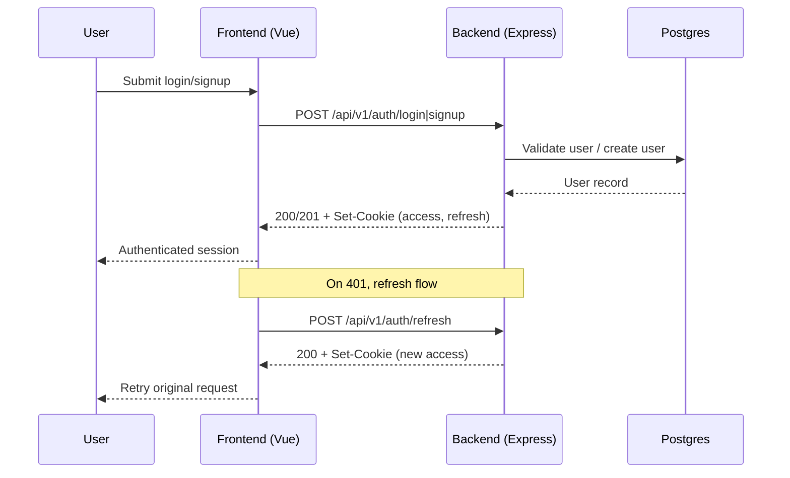
```mermaid
sequenceDiagram
  participant U as User
  participant FE as Frontend (Vue)
  participant API as Backend (Express)
  participant DB as Postgres

  U->>FE: Submit login/signup
  FE->>API: POST /api/v1/auth/login|signup
  API->>DB: Validate user / create user
  DB-->>API: User record
  API-->>FE: 200/201 + Set-Cookie (access, refresh)
  FE-->>U: Authenticated session

  Note over FE,API: On 401, refresh flow
  FE->>API: POST /api/v1/auth/refresh
  API-->>FE: 200 + Set-Cookie (new access)
  FE-->>U: Retry original request
```

## Budgeting & Transactions
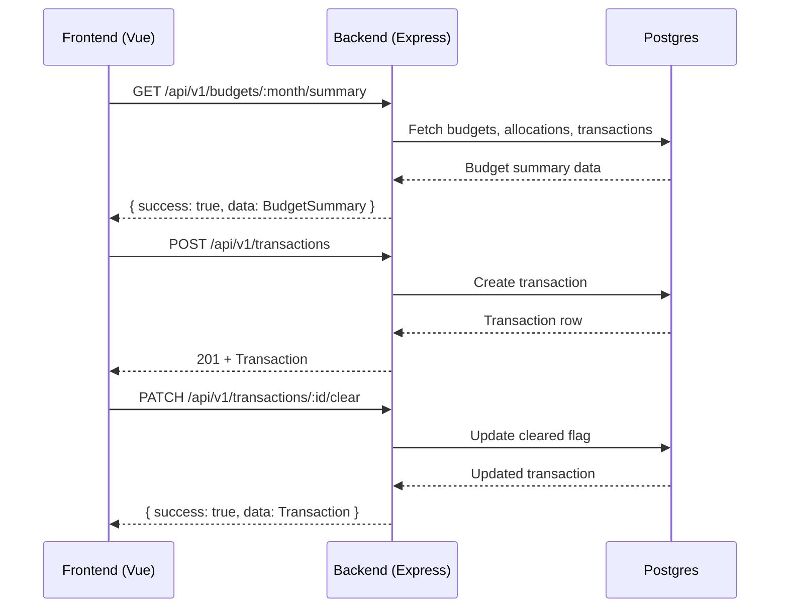
```mermaid
sequenceDiagram
  participant FE as Frontend (Vue)
  participant API as Backend (Express)
  participant DB as Postgres

  FE->>API: GET /api/v1/budgets/:month/summary
  API->>DB: Fetch budgets, allocations, transactions
  DB-->>API: Budget summary data
  API-->>FE: { success: true, data: BudgetSummary }

  FE->>API: POST /api/v1/transactions
  API->>DB: Create transaction
  DB-->>API: Transaction row
  API-->>FE: 201 + Transaction

  FE->>API: PATCH /api/v1/transactions/:id/clear
  API->>DB: Update cleared flag
  DB-->>API: Updated transaction
  API-->>FE: { success: true, data: Transaction }
```

## Extra Money Plan
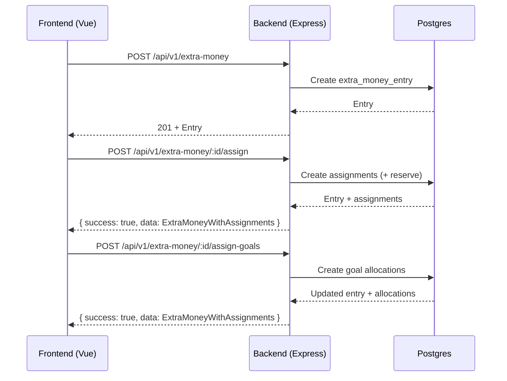
```mermaid
sequenceDiagram
  participant FE as Frontend (Vue)
  participant API as Backend (Express)
  participant DB as Postgres

  FE->>API: POST /api/v1/extra-money
  API->>DB: Create extra_money_entry
  DB-->>API: Entry
  API-->>FE: 201 + Entry

  FE->>API: POST /api/v1/extra-money/:id/assign
  API->>DB: Create assignments (+ reserve)
  DB-->>API: Entry + assignments
  API-->>FE: { success: true, data: ExtraMoneyWithAssignments }

  FE->>API: POST /api/v1/extra-money/:id/assign-goals
  API->>DB: Create goal allocations
  DB-->>API: Updated entry + allocations
  API-->>FE: { success: true, data: ExtraMoneyWithAssignments }
```

## Recurring Transactions
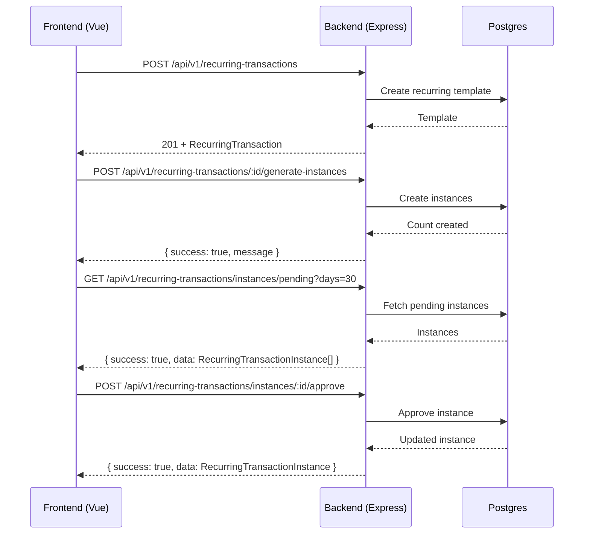
```mermaid
sequenceDiagram
  participant FE as Frontend (Vue)
  participant API as Backend (Express)
  participant DB as Postgres

  FE->>API: POST /api/v1/recurring-transactions
  API->>DB: Create recurring template
  DB-->>API: Template
  API-->>FE: 201 + RecurringTransaction

  FE->>API: POST /api/v1/recurring-transactions/:id/generate-instances
  API->>DB: Create instances
  DB-->>API: Count created
  API-->>FE: { success: true, message }

  FE->>API: GET /api/v1/recurring-transactions/instances/pending?days=30
  API->>DB: Fetch pending instances
  DB-->>API: Instances
  API-->>FE: { success: true, data: RecurringTransactionInstance[] }

  FE->>API: POST /api/v1/recurring-transactions/instances/:id/approve
  API->>DB: Approve instance
  DB-->>API: Updated instance
  API-->>FE: { success: true, data: RecurringTransactionInstance }
```

## Debts & Payments
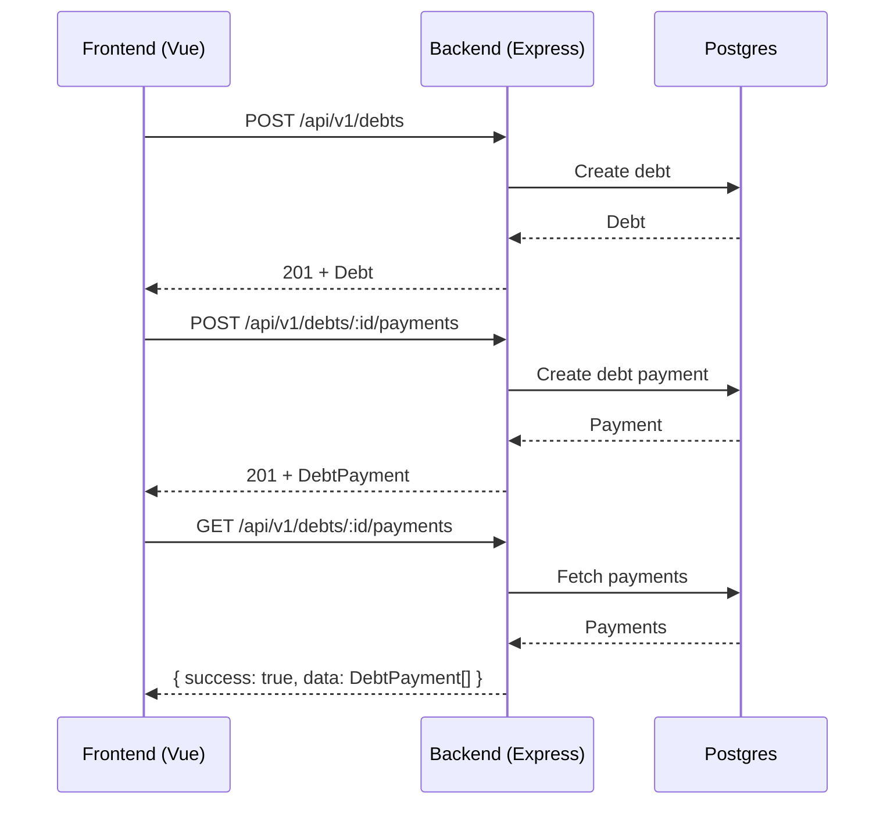
```mermaid
sequenceDiagram
  participant FE as Frontend (Vue)
  participant API as Backend (Express)
  participant DB as Postgres

  FE->>API: POST /api/v1/debts
  API->>DB: Create debt
  DB-->>API: Debt
  API-->>FE: 201 + Debt

  FE->>API: POST /api/v1/debts/:id/payments
  API->>DB: Create debt payment
  DB-->>API: Payment
  API-->>FE: 201 + DebtPayment

  FE->>API: GET /api/v1/debts/:id/payments
  API->>DB: Fetch payments
  DB-->>API: Payments
  API-->>FE: { success: true, data: DebtPayment[] }
```

## Goals & Contributions
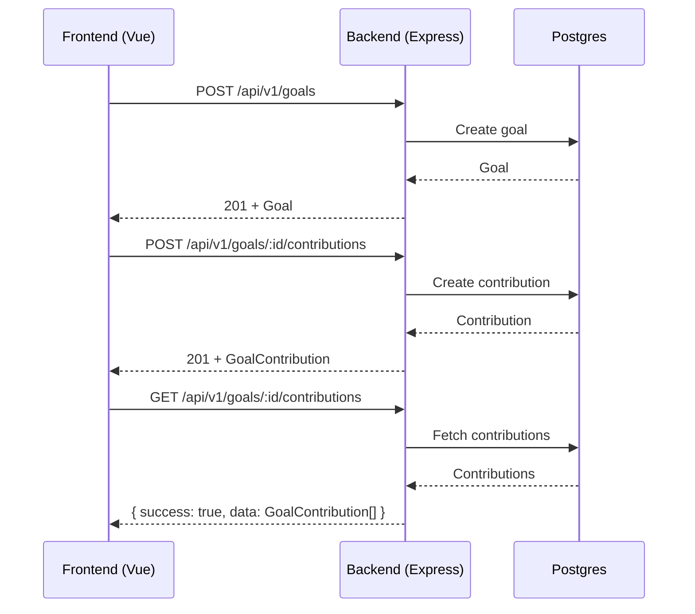
```mermaid
sequenceDiagram
  participant FE as Frontend (Vue)
  participant API as Backend (Express)
  participant DB as Postgres

  FE->>API: POST /api/v1/goals
  API->>DB: Create goal
  DB-->>API: Goal
  API-->>FE: 201 + Goal

  FE->>API: POST /api/v1/goals/:id/contributions
  API->>DB: Create contribution
  DB-->>API: Contribution
  API-->>FE: 201 + GoalContribution

  FE->>API: GET /api/v1/goals/:id/contributions
  API->>DB: Fetch contributions
  DB-->>API: Contributions
  API-->>FE: { success: true, data: GoalContribution[] }
```

## Households & Settings
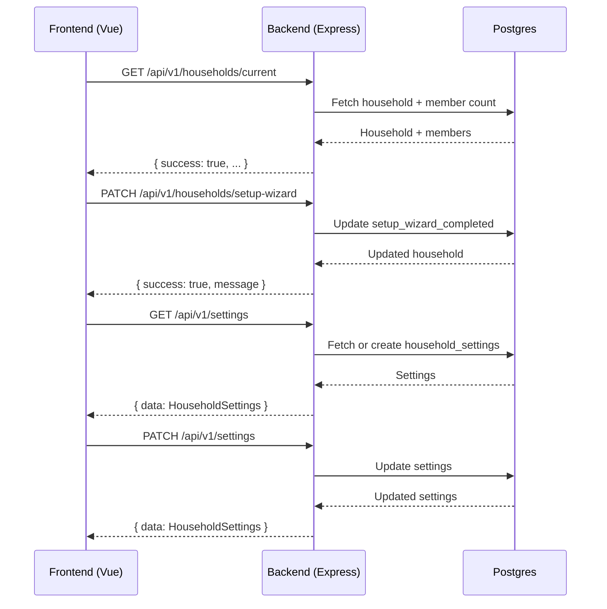
```mermaid
sequenceDiagram
  participant FE as Frontend (Vue)
  participant API as Backend (Express)
  participant DB as Postgres

  FE->>API: GET /api/v1/households/current
  API->>DB: Fetch household + member count
  DB-->>API: Household + members
  API-->>FE: { success: true, ... }

  FE->>API: PATCH /api/v1/households/setup-wizard
  API->>DB: Update setup_wizard_completed
  DB-->>API: Updated household
  API-->>FE: { success: true, message }

  FE->>API: GET /api/v1/settings
  API->>DB: Fetch or create household_settings
  DB-->>API: Settings
  API-->>FE: { data: HouseholdSettings }

  FE->>API: PATCH /api/v1/settings
  API->>DB: Update settings
  DB-->>API: Updated settings
  API-->>FE: { data: HouseholdSettings }
```

## Assignments (Income -> Categories/Sections)
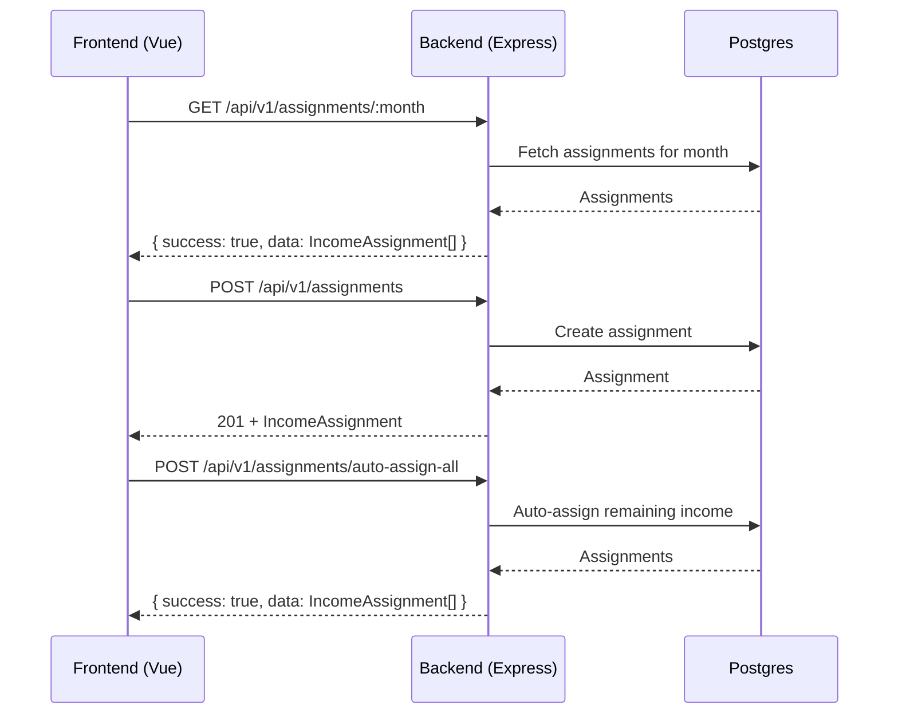
```mermaid
sequenceDiagram
  participant FE as Frontend (Vue)
  participant API as Backend (Express)
  participant DB as Postgres

  FE->>API: GET /api/v1/assignments/:month
  API->>DB: Fetch assignments for month
  DB-->>API: Assignments
  API-->>FE: { success: true, data: IncomeAssignment[] }

  FE->>API: POST /api/v1/assignments
  API->>DB: Create assignment
  DB-->>API: Assignment
  API-->>FE: 201 + IncomeAssignment

  FE->>API: POST /api/v1/assignments/auto-assign-all
  API->>DB: Auto-assign remaining income
  DB-->>API: Assignments
  API-->>FE: { success: true, data: IncomeAssignment[] }
```

## Categories & Sections
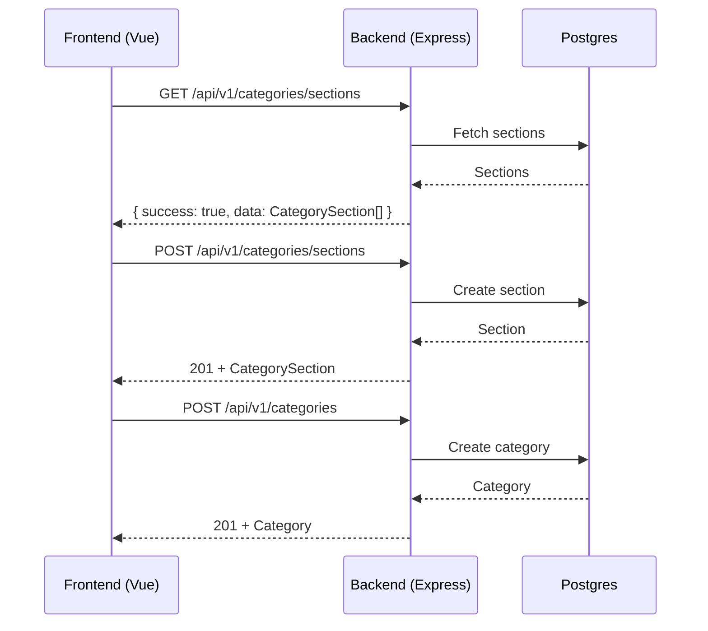
```mermaid
sequenceDiagram
  participant FE as Frontend (Vue)
  participant API as Backend (Express)
  participant DB as Postgres

  FE->>API: GET /api/v1/categories/sections
  API->>DB: Fetch sections
  DB-->>API: Sections
  API-->>FE: { success: true, data: CategorySection[] }

  FE->>API: POST /api/v1/categories/sections
  API->>DB: Create section
  DB-->>API: Section
  API-->>FE: 201 + CategorySection

  FE->>API: POST /api/v1/categories
  API->>DB: Create category
  DB-->>API: Category
  API-->>FE: 201 + Category
```

## Budget Allocations & Account Balance Assignment
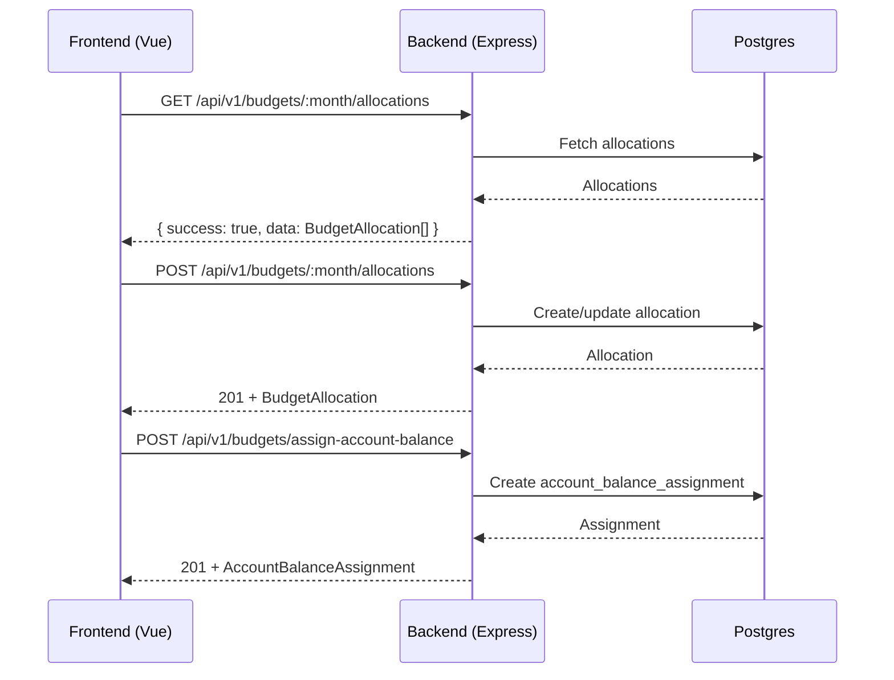
```mermaid
sequenceDiagram
  participant FE as Frontend (Vue)
  participant API as Backend (Express)
  participant DB as Postgres

  FE->>API: GET /api/v1/budgets/:month/allocations
  API->>DB: Fetch allocations
  DB-->>API: Allocations
  API-->>FE: { success: true, data: BudgetAllocation[] }

  FE->>API: POST /api/v1/budgets/:month/allocations
  API->>DB: Create/update allocation
  DB-->>API: Allocation
  API-->>FE: 201 + BudgetAllocation

  FE->>API: POST /api/v1/budgets/assign-account-balance
  API->>DB: Create account_balance_assignment
  DB-->>API: Assignment
  API-->>FE: 201 + AccountBalanceAssignment
```

## Transactions: Reconcile + Splits
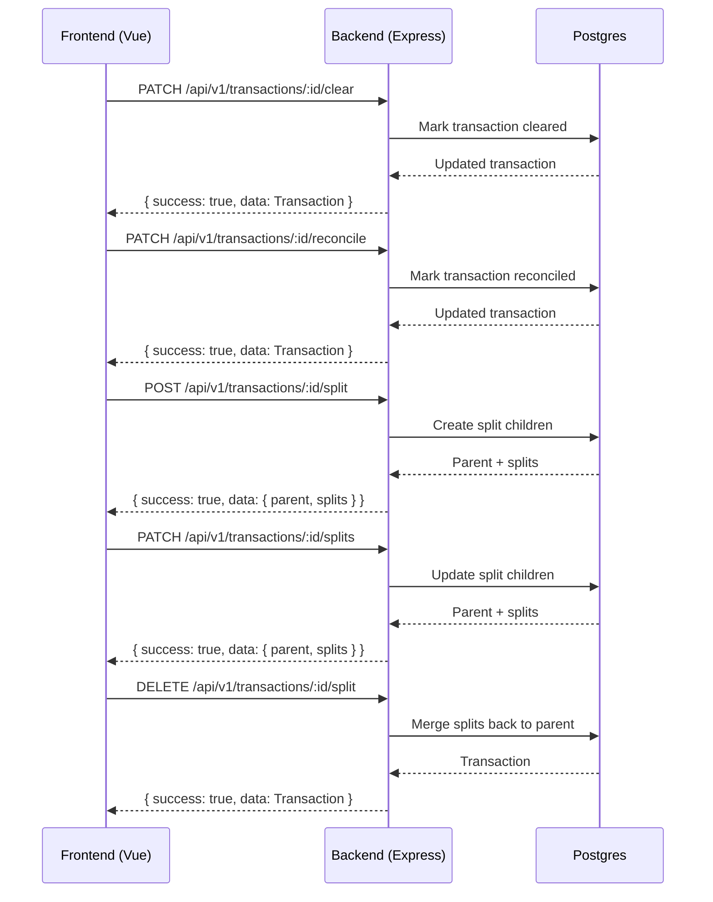
```mermaid
sequenceDiagram
  participant FE as Frontend (Vue)
  participant API as Backend (Express)
  participant DB as Postgres

  FE->>API: PATCH /api/v1/transactions/:id/clear
  API->>DB: Mark transaction cleared
  DB-->>API: Updated transaction
  API-->>FE: { success: true, data: Transaction }

  FE->>API: PATCH /api/v1/transactions/:id/reconcile
  API->>DB: Mark transaction reconciled
  DB-->>API: Updated transaction
  API-->>FE: { success: true, data: Transaction }

  FE->>API: POST /api/v1/transactions/:id/split
  API->>DB: Create split children
  DB-->>API: Parent + splits
  API-->>FE: { success: true, data: { parent, splits } }

  FE->>API: PATCH /api/v1/transactions/:id/splits
  API->>DB: Update split children
  DB-->>API: Parent + splits
  API-->>FE: { success: true, data: { parent, splits } }

  FE->>API: DELETE /api/v1/transactions/:id/split
  API->>DB: Merge splits back to parent
  DB-->>API: Transaction
  API-->>FE: { success: true, data: Transaction }
```

## Accounts & Credit Card Status
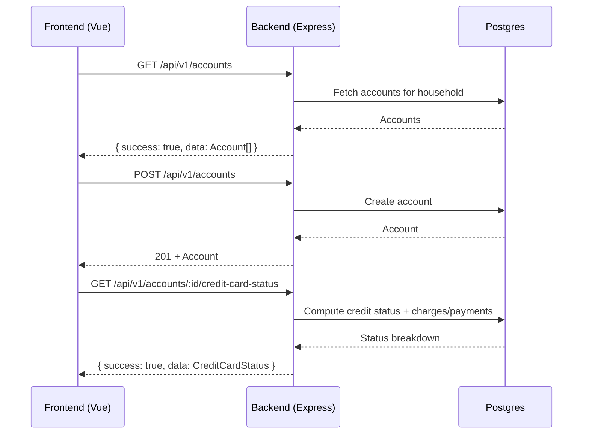
```mermaid
sequenceDiagram
  participant FE as Frontend (Vue)
  participant API as Backend (Express)
  participant DB as Postgres

  FE->>API: GET /api/v1/accounts
  API->>DB: Fetch accounts for household
  DB-->>API: Accounts
  API-->>FE: { success: true, data: Account[] }

  FE->>API: POST /api/v1/accounts
  API->>DB: Create account
  DB-->>API: Account
  API-->>FE: 201 + Account

  FE->>API: GET /api/v1/accounts/:id/credit-card-status
  API->>DB: Compute credit status + charges/payments
  DB-->>API: Status breakdown
  API-->>FE: { success: true, data: CreditCardStatus }
```

## Income Sources & Assignments
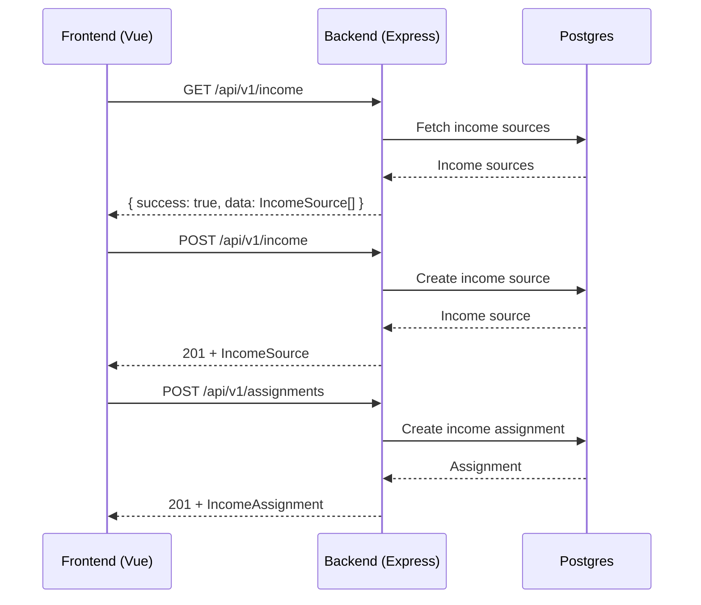
```mermaid
sequenceDiagram
  participant FE as Frontend (Vue)
  participant API as Backend (Express)
  participant DB as Postgres

  FE->>API: GET /api/v1/income
  API->>DB: Fetch income sources
  DB-->>API: Income sources
  API-->>FE: { success: true, data: IncomeSource[] }

  FE->>API: POST /api/v1/income
  API->>DB: Create income source
  DB-->>API: Income source
  API-->>FE: 201 + IncomeSource

  FE->>API: POST /api/v1/assignments
  API->>DB: Create income assignment
  DB-->>API: Assignment
  API-->>FE: 201 + IncomeAssignment
```
